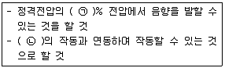
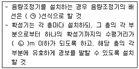
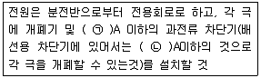
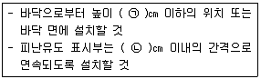
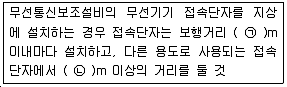
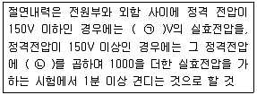

# 소방설비기사(전기분야)20180915(학생용) - 소방전기시설의 구조 및원리

> 원본: `소방설비기사(전기분야)20180915(학생용).pdf`
> 개인학습용 변환본.

## 61. 문제

61. 무선통신보조설비의 분배기ㆍ분파기 및 혼합기의 설치기준 
중 틀린 것은?
    ① 먼지ㆍ습기 및 부식 등에 따라 기능에 이상을 가져오지 
아니하도록 할 것
    ② 임피던스는 50Ω의 것으로 할 것
    ③ 전원은 전기가 정상적으로 공급되는 축전지, 전기저장장
치 또는 교류전압 옥내간선으로 하고, 전원까지의 배선
은 전용으로 할 것
    ④ 점검에 편리하고 화재 등의 재해로 인한 피해의 우려가 
없는 장소에 설치할 것

### 정답

1번

### 해설

정답은 1번입니다. 선택지의 핵심개념 을 확인하세요.

### 그림

## 62. 문제

62. 피난기구의 용어의 정의 중 다음 ( ) 안에 알맞은 것은?
    
    ① 구조대
② 완강기
    ③ 간이완강기
④ 다수인피난장비

### 정답

1번

### 해설

정답은 1번입니다. 선택지의 핵심개념 을 확인하세요.

### 그림

## 63. 문제

63. 청각장애인용 시각경보장치는 천장의 높이가 2m 이하인 경
우에는 천장으로부터 몇 m 이내의 장소에 설치하여야 하는
가?
    ① 0.1
② 0.15
    ③ 1.0
④ 1.5

### 정답

1번

### 해설

정답은 1번입니다. 선택지의 핵심개념 을 확인하세요.

### 그림

## 64. 문제

64. 자동화재탐지설비의 연기복합형 감지기를 설치할 수 없는 
부착높이는?
    ① 4m 이상 8m 미만
  ② 8m 이상 15m 미만
    ③ 15m 이상 20m 미만  ④ 20m 이상

### 정답

1번

### 해설

정답은 1번입니다. 선택지의 핵심개념 을 확인하세요.

### 그림

## 65. 문제

65. 비상조명등의 설치 제외 기준 중 다음 ( ) 안에 알맞은 것
은?
    
    ① 2
② 5
    ③ 15
④ 25

### 정답

1번

### 해설

정답은 1번입니다. 선택지의 핵심개념 을 확인하세요.

### 그림

## 66. 문제

66. 각 소방 설비별 비상전원의 종류와 비상전원 최소용량의 연
결이 틀린 것은? (단, 소방설비 – 비상전원의 종류 – 비상전
원 최소용량 순서이다.)(문제 오류로 가답안 발표시 1번으로 
발표되었지만. 확정답안 발표시 1, 4번이 정답 처리 되었습
니다. 여기서는 1번을 누르면 정답 처리 됩니다.)
    ① 자동화재탐지설비 – 축전지설비 – 20분
    ② 비상조명등설비 – 축전지설비 또는 자가발전설비 – 20분
    ③ 청정소화약제소화설비(할로겐화합물 및 불활성기체소화
설비) - 축전지설비 또는 자가발전설비 – 20분
    ④ 유도등 – 축전지 – 20분

### 정답

1번

### 해설

정답은 1번입니다. 선택지의 핵심개념 을 확인하세요.

### 그림

## 67. 문제

67. 연기감지기의 설치기준 중 틀린 것은?(문제 오류로 가답안 
발표시 2번으로 발표되었지만. 확정답안 발표시 2, 4번이 
정답 처리 되었습니다. 여기서는 2번을 누르면 정답 처리 
됩니다.)
    ① 부착높이 4m 이상 20m 미만에는 3종 감지기를 설치할 
수 없다.
    ② 복도 및 통로에 있어서 1종 및 2종은 보행거리 30m마다 
설치한다.
    ③ 계단 및 경사로에 있어서 3종은 수직거리 10m마다 설치
한다.
    ④ 감지기는 벽이나 보로부터 0.6m 이상 떨어진 곳에 설치
하여야 한다.

### 정답

1번

### 해설

정답은 1번입니다. 선택지의 핵심개념 을 확인하세요.

### 그림

## 68. 문제

68. 비상콘센트용의 풀박스 등은 방청도장을 한것으로서 두께는 
최소 몇 mm 이상의 철판으로 하여야 하는가?
    ① 1.0
② 1.2
    ③ 1.5
④ 1.6

### 정답

1번

### 해설

정답은 1번입니다. 선택지의 핵심개념 을 확인하세요.

### 그림

## 69. 문제

69. 자동화재속보설비를 설치하여야 하는 특정소방대상물의 기
준 중 틀린 것은? (단, 사람이24시간 상시 근무하고 있는 
경우는 제외한다.)(관련 규정 개정전 문제로 여기서는 기존 
정답인 2번을 누르면 정답 처리됩니다. 자세한 내용은 해설
을 참고하세요.)
    ① 판매시설 중 전통시장
    ② 지하가 중 터널로서 길이가 1000m 이상인 것
    ③ 수련시설(숙박시설이 있는 건축물만 해당)로서 바닥면적
이 500m2 이상인 층이 있는 것
    ④ 업무시설, 창고시설, 교정 및 군사시설 중 국방ㆍ군사시
설, 발전시설(사람이 근무하지 않는 시간에는 무인경비시
스템으로 관리하는 시설만 해당)로서 바닥면적이 
1500m2 이상인 층이 있는 것

### 정답

1번

### 해설

정답은 1번입니다. 선택지의 핵심개념 을 확인하세요.

### 그림

## 70. 문제

70. 비상방송설비의 배선과 전원에 관한 설치기준 중 옳은 것
은?
    ① 부속회로의 전로와 대지 사이 및 배선상호간의 절연저항
은 1경계구역마다 직류 110V의 절연저항측정기를 사용
하여 측정한 절연저항이 1㏁ 이상이 되도록 한다.
    ② 전원은 전기가 정상적으로 공급되는 축전지 또는 교류전
압의 옥내간선으로 하고, 전원까지의 배선은 전용이 아
니어도 무방하다.
    ③ 비상방송설비에는 그 설비에 대한 감시 상태를 30분간 
지속한 후 유효하게 10분 이상 경보할 수 있는 축전지설
비를 설치하여야 한다.
    ④ 비상방송설비의 배선은 다른 전선과 별도의 관ㆍ덕트 몰
드 또는 풀박스 등에 설치하되 60V 미만의 약전류회로에 
사용하는 전선으로서 각각의 전압이 같을 때에는 그러하
지 아니하다.

### 정답

1번

### 해설

정답은 1번입니다. 선택지의 핵심개념 을 확인하세요.

### 그림

## 71. 문제

71. 7층인 의료시설에 적응성을 갖는 피난기구가 아닌 것은?
    ① 구조대
② 피난교
    ③ 피난용트랩
④ 미끄럼대
4과목 : 소방전기시설의 구조 및 원리

소방설비기사(전기분야)
◐2018년 09월 15일 필기 기출문제 ◑
전자문제집 CBT : www.comcbt.com
최강 자격증 기출문제 전자문제집 CBT : www.comcbt.com

### 정답

1번

### 해설

정답은 1번입니다. 선택지의 핵심개념 을 확인하세요.

### 그림

## 72. 문제

72. 비상방송설비의 음향장치 구조 및 성능기준중 다음 ( ) 안에 
알맞은 것은?
    
    ① ㉠ 65, ㉡ 단독경보형감지기
    ② ㉠ 65, ㉡ 자동화재탐지설비
    ③ ㉠ 80, ㉡ 단독경보형감지기
    ④ ㉠ 80, ㉡ 자동화재탐지설비

### 정답

1번

### 해설

정답은 1번입니다. 선택지의 핵심개념 을 확인하세요.

### 그림

## 73. 문제

73. 비상방송설비 음향장치의 설치기준 중 다음 ( ) 안에 알맞은 
것은?
    
    ① ㉠ 2, ㉡ 15
② ㉠ 2, ㉡ 25
    ③ ㉠ 3, ㉡ 15
④ ㉠ 3, ㉡ 25

### 정답

1번

### 해설

정답은 1번입니다. 선택지의 핵심개념 을 확인하세요.

### 그림

## 74. 문제

74. 누전경보기 전원의 설치기준 중 다음 ( )안에 알맞은 것은?
    
    ① ㉠ 15, ㉡ 30
② ㉠ 15, ㉡ 20
    ③ ㉠ 10, ㉡ 30
④ ㉠ 10, ㉡ 20

### 정답

1번

### 해설

정답은 1번입니다. 선택지의 핵심개념 을 확인하세요.

### 그림

## 75. 문제

75. 유도등 예비전원의 종류로 옳은 것은?
    ① 알칼리계 2차축전지
② 리튬계 1차축전지
    ③ 리튬 이온계 2차축전지
④ 수은계 1차축전지

### 정답

1번

### 해설

정답은 1번입니다. 선택지의 핵심개념 을 확인하세요.

### 그림

## 76. 문제

76. 축광방식의 피난유도선 설치기준 중 다음 ( )안에 알맞은 것
은?
    
    ① ㉠ 50, ㉡ 50
② ㉠ 50, ㉡ 100
    ③ ㉠ 100, ㉡ 50
④ ㉠ 100, ㉡ 100

### 정답

1번

### 해설

정답은 1번입니다. 선택지의 핵심개념 을 확인하세요.

### 그림

## 77. 문제

77. 무선통신보조설비 무선기기 접속단자의 설치 기준 중 다음 
( ) 안에 알맞은 것은?
    
    ① ㉠ 400, ㉡ 5
② ㉠ 300, ㉡ 5
    ③ ㉠ 400, ㉡ 3
④ ㉠ 300, ㉡ 3

### 정답

1번

### 해설

정답은 1번입니다. 선택지의 핵심개념 을 확인하세요.

### 그림

## 78. 문제

78. 비상콘센트설비의 전원부와 외함 사이의 절연내력 기준 중 
다음 ( ) 안에 알맞은 것은?
    
    ① ㉠ 500, ㉡ 2
② ㉠ 500, ㉡ 3
    ③ ㉠ 1000, ㉡ 2
④ ㉠ 1000, ㉡ 3

### 정답

1번

### 해설

정답은 1번입니다. 선택지의 핵심개념 을 확인하세요.

### 그림

## 79. 문제

79. 자동화재탐지설비의 경계구역에 대한 설정기준 중 틀린 것
은?
    ① 지하구의 경우 하나의 경계구역의 길이는 800m 이하로 
할 것
    ② 하나의 경계구역이 2개 이상의 층에 미치지 아니하도록 
할 것
    ③ 하나의 경계구역의 면적은 600m2 이하로하고 한 변의 
길이는 50m 이하로 할 것
    ④ 하나의 경계구역이 2개 이상의 건축물에 미치지 아니하
도록 할 것

### 정답

1번

### 해설

정답은 1번입니다. 선택지의 핵심개념 을 확인하세요.

### 그림

## 80. 문제

80. 비상경보설비를 설치하여야 하는 특정소방대상물의 기준 중 
옳은 것은? (단, 지하구, 모래ㆍ석재 등 불연재료 창고 및 
위험물 저장ㆍ처리 시설 중 가스시설은 제외한다.)
    ① 지하층 또는 무창층의 바닥면적이 150m2이상인 것
    ② 공연장으로서 지하층 또는 무창층의 바닥 면적이 
200m2 이상인 것
    ③ 지하가 중 터널로서 길이가 400m 이상인 것
    ④ 30명 이상의 근로자가 작업하는 옥내작업장

소방설비기사(전기분야)
◐2018년 09월 15일 필기 기출문제 ◑
전자문제집 CBT : www.comcbt.com
최강 자격증 기출문제 전자문제집 CBT : www.comcbt.com
전자문제집 CBT 홈페이지 : www.comcbt.com
기출문제 및 해설집 다운로드  : www.comcbt.com/xe
전자문제집 CBT 앱(구글플레이) : [다운로드]
전자문제집 CBT란?
종이 문제집이 아닌 인터넷으로 문제를 풀고 자동으로 채점하며 
모의고사, 오답 노트, 해설까지 제공하는 무료 기출문제 학습 프
로그램으로 실제 시험에서 사용하는 OMR 형식의 CBT를 제공합
니다.
PC 버전 및 모바일 버전 완벽 연동
교사용/학생용 관리기능도 제공합니다.
오답 및 오탈자가 수정된 최신 자료와 해설은 전자문제집 CBT 
에서 확인하세요.
1
2
3
4
5
6
7
8
9
10
②
③
②
④
④
①
②
③
③
④
11
12
13
14
15
16
17
18
19
20
①
④
④
②
①
①
②
③
①
④
21
22
23
24
25
26
27
28
29
30
①
④
②
③
③
②
④
④
②
②
31
32
33
34
35
36
37
38
39
40
①
④
④
③
①
②
①
④
②
③
41
42
43
44
45
46
47
48
49
50
②
④
③
③
①
①
④
④
④
②
51
52
53
54
55
56
57
58
59
60
④
②
④
①
②
②
①
③
④
④
61
62
63
64
65
66
67
68
69
70
③
③
②
④
③
①
②
④
②
④
71
72
73
74
75
76
77
78
79
80
④
④
④
②
①
①
②
③
①
①

### 정답

1번

### 해설

정답은 1번입니다. 선택지의 핵심개념 을 확인하세요.

### 그림

