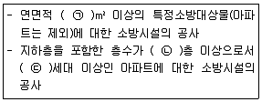

# 소방설비기사(전기분야)20190303(교사용) - 소방전기시설의 구조 및원리

> 원본: `소방설비기사(전기분야)20190303(교사용).pdf`
> 개인학습용 변환본.

## 61. 문제

61. 경계전로의 누설전류를 자동적으로 검출하여 이를 누전경보
기의 수신부에 송신하는 것을 무엇이라고 하는가?
    ① 수신부
② 확성기
    ❸ 변류기
④ 증폭기

### 정답

1번

### 해설

정답은 1번입니다. 선택지의 핵심개념 을 확인하세요.

### 그림

## 62. 문제

62. 누전경보기의 5~10회로까지 사용할 수 있는 집합형 수신기 
내부결선도에서 구성요소가 아닌 것은?
    ① 제어부
② 증폭부
    ❸ 조작부
④ 자동입력 절환부

### 정답

1번

### 해설

정답은 1번입니다. 선택지의 핵심개념 을 확인하세요.

### 그림

## 63. 문제

63. 비상콘센트설비의 화재안전기준에서 정하고 있는 저압의 정
의는?
    ❶ 직류는 750V 이하, 교류는 600V 이하인 것
    ② 직류는 750V 이하, 교류는 380V 이하인 것
    ③ 직류는 750V를, 교류는 600V를 넘고 7,000V 이하인 것
4과목 : 소방전기시설의 구조 및 원리

소방설비기사(전기분야)
◐2019년 03월 03일 필기 기출문제 ◑
전자문제집 CBT : www.comcbt.com
최강 자격증 기출문제 전자문제집 CBT : www.comcbt.com
    ④ 직류는 750V를, 교류는 380V를 넘고 7,000V 이하인 것

### 정답

1번

### 해설

정답은 1번입니다. 선택지의 핵심개념 을 확인하세요.

### 그림

## 64. 문제

64. 비상방송설비의 음향장치는 정격전압의 몇 % 전압에서 음
향을 발할 수 있는 것으로 하여야 하는가?
    ❶ 80
② 90
    ③ 100
④ 110

### 정답

1번

### 해설

정답은 1번입니다. 선택지의 핵심개념 을 확인하세요.

## 65. 문제

65. 자가발전설비, 비상전원수전설비 또는 전기저장장치(외부 전
기에너지를 저장해 두었다가 필요한 때 전기를 공급하는 장
치)를 비상콘센트설비의 비상전원으로 설치하여야하는 특정
소방대상물로 옳은 것은?
    ① 지하층을 제외한 층수가 4층 이상으로서 연면적 600m2 
이상인 특정소방대상물
    ② 지하층을 제외한 층수가 5층 이상으로서 연면적 
1,000m2 이상인 특정소방대상물
    ③ 지하층을 제외한 층수가 6층 이상으로서 연면적 
1,500m2 이상인 특정소방대상물
    ❹ 지하층을 제외한 층수가 7층 이상으로서 연면적 
2,000m2 이상인 특정소방대상물

### 정답

1번

### 해설

정답은 1번입니다. 선택지의 핵심개념 을 확인하세요.

## 66. 문제

66. 불꽃감지기의 설치기준으로 틀린 것은?
    ① 수분이 많이 발생할 우려가 있는 장소에는 방수형으로 
설치할 것
    ❷ 감지기를 천장에 설치하는 경우에는 감지기는 천장을 향
하여 설치할 것
    ③ 감지기는 화재감지를 유효하게 감지할 수있는 모서리 또
는 벽 등에 설치할 것
    ④ 감지기는 공칭감시거리와 공칭시야각을 기준으로 감시구
역이 모두 포용될 수 있도록 설치할 것

### 정답

1번

### 해설

정답은 1번입니다. 선택지의 핵심개념 을 확인하세요.

## 67. 문제

67. 무선통신보조설비의 무선기기 접속단자 중 지상에 설치하는 
접속단자는 보행거리 최대 몇 m 이내마다 설치하여야 하는
가?
    ① 5
② 50
    ③ 150
❹ 300

### 정답

1번

### 해설

정답은 1번입니다. 선택지의 핵심개념 을 확인하세요.

## 68. 문제

68. 정온식 감지선형 감지기에 관한 설명으로 옳은 것은?
    ① 일국소의 주위온도 변화에 따라서 차동 및 정온식의 성
능을 갖는 것을 말한다.
    ❷ 일국소의 주위온도가 일정한 온도 이상이 되었을 때 작
동하는 것으로서 외관이 전선으로 되어 있는 것을 말한
다.
    ③ 그 주위온도가 일정한 온도상승률 이상이 되었을 때 작
동하는 것을 말한다.
    ④ 그 주위온도가 일정한 온도상승률 이상이 되었을 때 작
동하는 것으로서 광범위한 열효과의 누적에 의하여 동작
하는 것을 말한다.

### 정답

1번

### 해설

정답은 1번입니다. 선택지의 핵심개념 을 확인하세요.

## 69. 문제

69. 축전지의 자기방전을 보충함과 동시에 상용 부하에 대한 전
력공급은 충전기가 부담하도록 하되 충전기가 부담하기 어
려운 일시적인 대전류는 부하는 축전지로 하여금 부담하게 
하는 충전방식은?
    ① 과충전방식
② 균등충전방식
    ❸ 부동충전방식
④ 세류충전방식

### 정답

1번

### 해설

정답은 1번입니다. 선택지의 핵심개념 을 확인하세요.

## 70. 문제

70. 단독경보형 감지기 중 연동식감지기의 무선 기능에 대한 설
명으로 옳은 것은?
    ① 화재신호를 수신한 단독경보형 감지기는 60초 이내에 경
보를 발해야 한다.
    ❷ 무선통신 점검은 단독경보형 감지기가 서로 송수신하는 
방식으로 한다.
    ③ 작동한 단독경보형 감지기는 화재경보가 정지하기 전까
지 100초 이내 주기마다 화재신호를 발신해야 한다.
    ④ 무선통신 점검은 168시간 이내에 자동으로 실시하고 이
때 통신이상이 발생하는 경우에는 300초 이내에 통신이
상 상태의 단독경보형 감지기를 확인할 수 있도록 표시 
및 경보를 해야 한다.

### 정답

1번

### 해설

정답은 1번입니다. 선택지의 핵심개념 을 확인하세요.

## 71. 문제

71. 정온식감지기의 설치 시 공칭작동온도가 최고주위온도보다 
최소 몇 ℃ 이상 높은 것으로 설치하여야 하나?
    ① 10
❷ 20
    ③ 30
④ 40

### 정답

1번

### 해설

정답은 1번입니다. 선택지의 핵심개념 을 확인하세요.

## 72. 문제

72. 무선통신보조설비의 누설동축케이블의 설치기준으로 틀린 
것은?
    ❶ 끝부분에는 반사 종단저항을 견고하게 설치할 것
    ② 고압의 전로로부터 1.5m 이상 떨어진 위치에 설치할 것
    ③ 금속판 등에 따라 전파의 복사 또는 특성이 현저하게 저
하되지 아니하는 위치에 설치할 것
    ④ 불연 또는 난연성의 것으로서 습기에 따라 전기의 특성
이 변질되지 아니하는 것으로 설치할 것

### 정답

1번

### 해설

정답은 1번입니다. 선택지의 핵심개념 을 확인하세요.

## 73. 문제

73. 소화활동 시 안내방송에 사용하는 증폭기의 종류로 옳은 것
은?
    ① 탁상형
❷ 휴대형
    ③ Desk형
④ Rack형

### 정답

1번

### 해설

정답은 1번입니다. 선택지의 핵심개념 을 확인하세요.

## 74. 문제

74. 계단통로유도등은 각 층의 경사로 참 또는 계단참마다 설치
하도록 하고 있는데 1개 층에 경사로 참 또는 계단참이 2 
이상 있는 경우에는 몇 개의 계단참마다 계단통로유도 등을 
설치하여야 하는가?
    ❶ 2개
② 3개
    ③ 4개
④ 5개

### 정답

1번

### 해설

정답은 1번입니다. 선택지의 핵심개념 을 확인하세요.

## 75. 문제

75. 자동화재탐지설비의 수신기의 각 회로별 종단에 설치되는 
감지기에 접속되는 배선의 전압은 감지기 정격전압의 최소 
몇 % 이상이어야 하는가?
    ① 50
② 60
    ③ 70
❹ 80

### 정답

1번

### 해설

정답은 1번입니다. 선택지의 핵심개념 을 확인하세요.

## 76. 문제

76. 비상벨설비 또는 자동식 사이렌설비에는 그 설비에 대한 감
시상태를 몇 시간 지속한 후 유효하게 10분 이상 경보할 수 
있는 축전지 설비(수신기에 내장하는 경우를 포함한다)를 설
치하여야 하는가?
    ❶ 1시간
② 2시간
    ③ 4시간
④ 6시간

### 정답

1번

### 해설

정답은 1번입니다. 선택지의 핵심개념 을 확인하세요.

## 77. 문제

77. 자동화재속보설비의 설치기준으로 틀린 것은?
    ❶ 조작스위치는 바닥으로부터 1m 이상 1.5m 이하의 높이
에 설치할 것
    ② 속보기는 소방관서에 통신망으로 통보하도록 하며, 데이
터 또는 코드전송방식을 부가적으로 설치할 수 있다.
    ③ 자동화재탐지설비와 연동으로 작동하여 자동적으로 화재
발생 상황을 소방관서에 전달되는 것으로 할 것
    ④ 속보기는 소방청장이 정하여 고시한「자동화재속보설비
의 속보기의 성능인증 및 제품검사의 기술기준」에 적합
한 것으로 설치하여야 한다.

소방설비기사(전기분야)
◐2019년 03월 03일 필기 기출문제 ◑
전자문제집 CBT : www.comcbt.com
최강 자격증 기출문제 전자문제집 CBT : www.comcbt.com

### 정답

1번

### 해설

정답은 1번입니다. 선택지의 핵심개념 을 확인하세요.

## 78. 문제

78. 휴대용비상조명등 설치 높이는?
    ① 0.8m ~ 1.0m
❷ 0.8m ~ 1.5m
    ③ 1.0m ~ 1.5m
④ 1.0m ~ 1.8m

### 정답

1번

### 해설

정답은 1번입니다. 선택지의 핵심개념 을 확인하세요.

## 79. 문제

79. 자동화재탐지설비의 화재안전기준에서 사용하는 용어가 아
닌 것은?
    ① 중계기
② 경계구역
    ③ 시각경보장치
❹ 단독경보형 감지기

### 정답

1번

### 해설

정답은 1번입니다. 선택지의 핵심개념 을 확인하세요.

## 80. 문제

80. 비상경보설비를 설치하여야 할 특정소방대상물로 옳은 것
은? (단, 지하구, 모래ㆍ석재 등 불연재료 창고 및 위험물 
저장ㆍ처리 시설 중 가스시설은 제외한다.)
    ① 지하가 중 터널로서 길이가 400m 이상인 것
    ② 30명 이상의 근로자가 작업하는 옥내작업장
    ❸ 지하층 또는 무창층의 바닥면적이 150m2(공연장의 경우 
100m2) 이상인 것
    ④ 연면적 300m2(지하가 중 터널 또는 사람이 거주하지 않
거나 벽이 없는 축사 등 동ㆍ식물 관련시설은 제외) 이
상인 것
전자문제집 CBT 홈페이지 : www.comcbt.com
기출문제 및 해설집 다운로드  : www.comcbt.com/xe
전자문제집 CBT 앱(구글플레이) : [다운로드]
전자문제집 CBT란?
종이 문제집이 아닌 인터넷으로 문제를 풀고 자동으로 채점하며 
모의고사, 오답 노트, 해설까지 제공하는 무료 기출문제 학습 프
로그램으로 실제 시험에서 사용하는 OMR 형식의 CBT를 제공합
니다.
PC 버전 및 모바일 버전 완벽 연동
교사용/학생용 관리기능도 제공합니다.
오답 및 오탈자가 수정된 최신 자료와 해설은 전자문제집 CBT 
에서 확인하세요.
1
2
3
4
5
6
7
8
9
10
③
②
②
④
①
④
②
②
①
④
11
12
13
14
15
16
17
18
19
20
①
④
②
①
④
④
①
④
①
②
21
22
23
24
25
26
27
28
29
30
③
③
③
④
④
④
②
③
④
②
31
32
33
34
35
36
37
38
39
40
①
③
②
②
④
①
②
①
②
③
41
42
43
44
45
46
47
48
49
50
①
③
②
②
③
②
②
④
③
①
51
52
53
54
55
56
57
58
59
60
③
①
③
④
④
③
④
③
②
④
61
62
63
64
65
66
67
68
69
70
③
③
①
①
④
②
④
②
③
②
71
72
73
74
75
76
77
78
79
80
②
①
②
①
④
①
①
②
④
③

### 정답

1번

### 해설

정답은 1번입니다. 선택지의 핵심개념 을 확인하세요.
