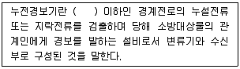

# 소방설비기사(전기분야)20190427(해설집) - 소방전기시설의 구조 및원리

> 원본: `소방설비기사(전기분야)20190427(해설집).pdf`
> 개인학습용 변환본.

## 61. 문제

61. 무선통신보조설비의 증폭기에는 비상전원이 부착된 것으로 
하고 비상전원의 용량은 무선통신보조설비를 유효하게 몇 
분 이상 작동시킬 수 있는 것이어야 하는가?
    ① 10분
② 20분
    ③ 30분
④ 40분
<문제 해설>
증폭기에는 비상전원이 부착된 것으로 하고 해당 비상전원 용량
은
무선통신보조설비를 유효하게 30분 이상 작동시킬 수 있는 것으
로 할 것.

### 정답

1번

### 해설

정답은 1번입니다. 선택지의 핵심개념 을 확인하세요.

## 62. 문제

62. 비상방송설비의 배선에 대한 설치기준으로 틀린 것은?
    ① 배선은 다른 용도의 전선과 동일한 관, 덕트, 몰드 또는 
풀박스 등에 설치할 것
    ② 전원회로의 배선은 옥내소화전설비의 화재안전기준에 따
른 내화배선으로 설치할 것
    ③ 화재로 인하여 하나의 층의 확성기 또는 배선이 단락 또
는 단선되어도 다른 층의 화재통보에 지장이 없도록 할 
것
    ④ 부속회로의 전로와 대지 사이 및 배선 상호간의 절연저
항은 1경계구역마다 직류 250V의 절연저항측정기를 사
용하여 측정한 절연저항이 0.1MΩ 이상이 되도록 할 것
<문제 해설>
동일한 -> 별도의
[해설작성자 : 염둥]
비상방송설비의 배선 설치기준
1) 화재로 인하여 하나의 층의 확성기 또는 배선이 단락 또는 
단선되어도 다른 층의 화재통보에 지장이 없도록 할 것.
2) 전원회로의 배선은 내화배선에 따르고, 그 밖의 배선은 내화
배선 또는 내열배선에 따라 설치할 것.
3) 전원회로의 전로와 대지 사이 및 배선상호간의 절연저항은 
부속회로의 전로와 대지 사이 및 배선 상호간의
     절연저항은 1경계구역마다 직류 250V의 절연저항측정기를 
사용하여 측정한 절연저항이 0.1㏁ 이상이 되도록 할 것.
4) 비상방송설비의 배선은 다른 전선과 별도의 관·덕트(절연효력
이 있는 것으로 구획한 때에는 그 구획된 부분은
     별개의 덕트로 본다) 몰드 또는 풀박스등에 설치할 것.
4과목 : 소방전기시설의 구조 및 원리

본 해설집은 최강 자격증 기출문제 전자문제집 CBT 해설달기 프로젝트에 의해서 만들어진 자료입니다. 해설을 제공해 주신 모든 분들께 감사 드립니다.
소방설비기사(전기분야)
◐2019년 04월 27일 필기 기출문제 및 해설집◑
전자문제집 CBT : www.comcbt.com
기출문제 해설은 최강 자격증 기출문제 전자문제집 CBT : www.comcbt.com 통해서 실시간으로 변경됩니다.

### 정답

1번

### 해설

정답은 1번입니다. 선택지의 핵심개념 을 확인하세요.

## 63. 문제

63. 비상콘센트설비의 설치기준으로 틀린 것은?
    ① 개폐기에는 “비상콘센트”라고 표시한 표지를 할 것
    ② 하나의 전용회로에 설치하는 비상콘센트는 10개 이하로 
할 것
    ③ 비상전원을 실내에 설치하는 때에는 그 실내에 비상조명
등을 설치할 것
    ④ 비상전원은 비상콘센트설비를 유효하게 10분 이상 작동
시킬 수 있는 용량으로 할 것
<문제 해설>
비상전원은 비상콘센트설비를 유효하게 20분 이상 작동시킬 수 
있는 용량으로 할 것

### 정답

1번

### 해설

정답은 1번입니다. 선택지의 핵심개념 을 확인하세요.

## 64. 문제

64. 비상전원이 비상조명등을 60분 이상 유효하게 작동시킬 수 
있는 용량으로 하지 않아도 되는 특정소방대상물은?
    ① 지하상가
    ② 숙박시설
    ③ 무장층으로서 용도가 소매시장
    ④ 지하층을 제외한 층수가 11층 이상의 층
<문제 해설>
비상전원이 비상조명등을 60분 이상 유효하게 작동시킬 수 있는 
용량으로 해야하는 특정소방대상물

### 정답

1번

### 해설

정답은 1번입니다. 선택지의 핵심개념 을 확인하세요.

## 65. 문제

65. 일국소의 주위온도가 일정한 온도 이상이 되는 경우에 작동
하는 것으로서 외관이 전선으로 되어 있는 감지기는 어떤 
것인가?
    ① 공기흡입형
    ② 광전식분리형
    ③ 차동식스포트형
    ④ 정온식감지선형
<문제 해설>
일국소만 보고 스포트형 찍은 당신
뒤에 외관이 전선인 경우일때는 감지선형밖에 없다.!
[해설작성자 : 내가 이런문제를 틀리다니]
말뜻만 보고도 풀수 있는문제임
일정온도-정온
전선-감지선형
합하면 정온식 감지선형
[해설작성자 : wuhanroach]

### 정답

1번

### 해설

정답은 1번입니다. 선택지의 핵심개념 을 확인하세요.

## 66. 문제

66. 비상콘센트를 보호하기 위한 비상콘센트 보호함의 설치기준
으로 틀린 것은?
    ① 비상콘센트 보호함에는 쉽게 개폐할 수 있는 문을 설치
하여야 한다.
    ② 비상콘센트 보호함 상부에 적색의 표시등을 설치하여야 
한다.
    ③ 비상콘센트 보호함에는 그 내부에 “비상콘센트”라고 표
시한 표식을 하여야 한다.
    ④ 비상콘센트 보호함을 옥내소화전함 등과 접속하여 설치
하는 경우에는 옥내소화전함 등의 표시등과 겸용할 수 
있다.
<문제 해설>
비상콘센트 보호함에는 그 외부에 “비상콘센트”라고 표시한 표
식을 하여야 한다.
[추가 해설]
비상 콘센트 보호함의 설치기준(비상콘센트설비의 화재안전기준 
제5조)
1) 보호함에는 쉽게 개폐할 수 있는 문을 설치할 것.
2) 보호함 표면에 "비상콘센트"라고 표시한 표지를 할 것.
3) 보호함 상부에 적색의 표시등을 설치할 것. 다만, 비상콘센트
의 보호함을 옥내소화전함 등과 접속하여
     설치하는 경우에는 옥내소화전함 등의 표시등과 겸용할 수 
있다.

### 정답

1번

### 해설

정답은 1번입니다. 선택지의 핵심개념 을 확인하세요.

## 67. 문제

67. 소방회로용의 것으로 수전설비, 변전설비 그 밖의 기기 및 
배선을 금속제 외함에 수납한 것으로 정의되는 것은?
    ① 전용분전반
② 공용분전반
    ③ 공용큐비클식
④ 전용큐비클식
<문제 해설>
전용큐비클식 : 소방회로용의 것으로 수전설비, 변전설비 그 밖
의 기기 및 배선을 금속제 외함에 수납한 것.
공용큐비클식 : 소방회로 및 일반회로 겸용의 것으로서 수전설
비, 변전설비 그 밖의 기기 및 배선을 금속제
                             외함에 수납한 것.
전용배전반 : 소방회로 전용의 것으로서 개폐기, 과전류차단기, 
계기 그 밖의 배선용기기 및 배손을 금속제
                         외함에 수납한 것.
공용배전반 : 소방회로 및 일반회로 겸용의 것으로서 개폐기, 과
전류차단기, 계기 그 밖의 배선용 기기 및
                         배선을 금속제 외함에 수납한 것.
[해설작성자 : comcbt.com 이용자]
외우기 쉽게 말해보자면
전용이 들어간 것은 소방회로 전용이고 공용은 소방회로 및 일
반회로 겸용인것
분전반과 큐비클식을 구분할때는 분전반은 분기개폐기,분기과전
류차단기 처럼 앞글자가 분이 들어감
그래서 분이 들어가면 분전반으로 기억
[해설작성자 : 비전공잔데 합격가자]

### 정답

1번

### 해설

정답은 1번입니다. 선택지의 핵심개념 을 확인하세요.

## 68. 문제

68. 비상방송설비 음향장치에 대한 설치기준으로 옳은 것은?
    ① 다른 전기회로에 따라 유도장애가 생기지 않도록 한다.
    ② 음량조정기를 설치하는 경우 음량조정기의 배선은 2선식
으로 한다.
    ③ 다른 방송설비와 공용하는 것에 있어서는 화재 시 비상
경보 외의 방송을 차단되는 구조가 아니어야 한다.
    ④ 기동장치에 따른 화재신고를 수신한 후 필요한 음량으로 
화재발생 상황 및 피난에 유효한 방송이 자동으로 개시

본 해설집은 최강 자격증 기출문제 전자문제집 CBT 해설달기 프로젝트에 의해서 만들어진 자료입니다. 해설을 제공해 주신 모든 분들께 감사 드립니다.
소방설비기사(전기분야)
◐2019년 04월 27일 필기 기출문제 및 해설집◑
전자문제집 CBT : www.comcbt.com
기출문제 해설은 최강 자격증 기출문제 전자문제집 CBT : www.comcbt.com 통해서 실시간으로 변경됩니다.
될 때까지의 소요시간은 60초 이하로 한다.
<문제 해설>
비상방송설비 음향장치에 대한 설치기준

### 정답

1번

### 해설

정답은 1번입니다. 선택지의 핵심개념 을 확인하세요.

## 69. 문제

69. 객석 내의 통로의 직선부분의 길이가 85m 이다. 객석유도
등을 몇 개 설치하여야 하는가?
    ① 17개
② 19개
    ③ 21개
④ 22개
<문제 해설>
*객석 유도등 공식*
*소수점이하는 반드시 절상!!
통로 직선부분의 길이/4-1
=85/4-1=20.25=21
[해설작성자 : guess]
객석유도등 설치기준
설치개수 = [ 객석의 통로의 직선부분의 길이(m) / 4 ] - 1
(소수점 이하 절상)
[해설작성자 : 전기]

### 정답

1번

### 해설

정답은 1번입니다. 선택지의 핵심개념 을 확인하세요.

## 70. 문제

70. 자동화재탐지설비의 감지기회로에 설치하는 종단저항의 설
치기준으로 틀린 것은?
    ① 감지기회로 끝부분에 설치한다.
    ② 점검 및 관리가 쉬운 장소에 설치하아여 한다.
    ③ 전용함에 설치하는 경우 그 설치 높이는 바닥으로부터 
0.8m 이내에 설치하여야 한다.
    ④ 종단감지기에 설치할 경우에는 구별이 쉽도록 해당감지
기의 기판 및 감지기 외부 등에 별도의 표시를 하여야 
한다.
<문제 해설>
*자동화재탐지설비의 감지기회로에 설치하는 종단저항의 설치기
준*
① 점검 및 관리가 쉬운 장소에 설치할 것
② 전용함 설치시 바닥으로부터 1.5[m] 이내의 높이에 설치할 
것
③ 감지기 회로의 끝부분에 설치할 것
[해설작성자 : guess]
자동화재탐지설비 및 시각경보장치의 화재안전기준(NFSC 203) 
제11조(배선)

### 정답

1번

### 해설

정답은 1번입니다. 선택지의 핵심개념 을 확인하세요.

## 71. 문제

71. 비상경보설비의 축전지설비의 구조에 대한 설명으로 틀린 
것은?
    ① 예비전원을 병렬로 접속하는 경우에는 역충전 방지 등의 
조치를 하여야 한다.
    ② 내부에 주전원의 양극을 동시에 개폐할 수 있는 전원스
위치를 설치하여야 한다.
    ③ 축전지설비는 접지전극에 교류전류를 통하는 회로방식을 
사용하여서는 아니된다.
    ④ 예비전원은 축전지설비용 예비전원과 외부부하 공급용 
예비전원을 별도로 설치하여야 한다.
<문제 해설>
비상경보설비의 축전지의 성능인증 및 제품검사의 기술기준
제3조(구조)

### 정답

1번

### 해설

정답은 1번입니다. 선택지의 핵심개념 을 확인하세요.

## 72. 문제

72. 신호의 전송로가 분기되는 장소에 설치하는 것으로 임피던
스 매칭과 신호 균등분배를 위해 사용되는 장치는?
    ① 혼합기
② 분배기
    ③ 증폭기
④ 분파기
<문제 해설>

### 정답

1번

### 해설

정답은 1번입니다. 선택지의 핵심개념 을 확인하세요.

## 73. 문제

73. 부착높이 3m, 바닥면적 50m2인 주요구조부를 내화구조로한 
소방대상물에 1종 열반도체식 차동식분포형감지기를 설치하
고자 할 때 감지부의 최소 설치개수는?
    ① 1개
② 2개
    ③ 3개
④ 4개
<문제 해설>

본 해설집은 최강 자격증 기출문제 전자문제집 CBT 해설달기 프로젝트에 의해서 만들어진 자료입니다. 해설을 제공해 주신 모든 분들께 감사 드립니다.
소방설비기사(전기분야)
◐2019년 04월 27일 필기 기출문제 및 해설집◑
전자문제집 CBT : www.comcbt.com
기출문제 해설은 최강 자격증 기출문제 전자문제집 CBT : www.comcbt.com 통해서 실시간으로 변경됩니다.
열전대 바닥면적 22m2
열반도체 8m 1종 65m2
[해설작성자 : 뭉게구름]

### 정답

1번

### 해설

정답은 1번입니다. 선택지의 핵심개념 을 확인하세요.

### 그림

## 74. 문제

74. 3선식 배선에 따라 상시 충전되는 유도등의 전기회로에 점
멸기를 설치하는 경우 유도등이 점등되어야 할 경우로 관계
없는 것은?
    ① 제연설비가 작동한 때
    ② 자동소화설비가 작동한 때
    ③ 비상경보설비의 발신기가 작동한 때
    ④ 자동화재탐지설비의 감지기가 작동한 때
<문제 해설>
3선식 배선으로 상시 충전되는 유도등의 전기회로에 점멸기를 
설치하는 경우, 점등되어야 할 경우
- 자동화재탐지설비의 감지기 또는 발신기가 작동되는 때
- 비상경보설비의 발신기가 작동되는 때
- 상용전원이 정전되거나 전원선이 단선되는 때
- 방재업무를 통제하는 곳 또는 전기실의 배전반에서 수동으로 
점등하는 때
- 자동소화설비가 작동되는 때
[해설작성자 : 꿈돌이소금빵]

### 정답

1번

### 해설

정답은 1번입니다. 선택지의 핵심개념 을 확인하세요.

### 그림

## 75. 문제

75. 누전경보기의 전원은 분전반으로부터 전용회로로 하고 각 
극에 개폐기와 몇 A 이하의 과전류차단기를 설치하여야 하
는가?
    ① 15
② 20
    ③ 25
④ 30
<문제 해설>
누전경보기의 전원기준
-각 극에 개폐기 및 15A이하의 과전류차단기를 설치할 것.
-분전반으로부터 전용회로로 할것.
[추가 해설]
전원은 분전반으로부터 전용회로로 하고, 각 극에 개폐기 및 
15A 이하의 과전류차단기
(배선용 차단기에 있어서는 20A 이하의 것으로 각 극을 개폐할 
수 있는 것)를 설치 할 것.

### 정답

1번

### 해설

정답은 1번입니다. 선택지의 핵심개념 을 확인하세요.

### 그림

## 76. 문제

76. 자동화재속보설비의 설치기준으로 틀린 것은?
    ① 조작스위치는 바닥으로부터 0.8m 이상 1.5m 이하의 높
이에 설치한다.
    ② 비상경보설비와 연동으로 작동하여 자동적으로 화재발생 
상황을 소방관서에 전달하도록 한다.
    ③ 속보기는 소방관서에 통신망으로 통보하도록 하며, 데이
터 또는 코드전송방식을 부가적으로 설치할 수 있다.
    ④ 속보기는 소방청장이 정하여 고시한 「자동화재속보설비
의 속보기의 성능인증 및 제품검사의 기술기준」에 적합
한 것으로 설치하여야 한다.
<문제 해설>
비상경보설비와 연동으로 --> 자동화재탐지설비와 연동으로
[해설작성자 : 와그라노]
자동화재 속보설비의 설치 기준
1) 자동화재탐지설비와 연동으로 작동하여 자동적으로 화재발생 
상황을 소방관서에 전달되는 것으로 할 것.
2) 조작스위치는 바닥으로부터 0.8m 이상 1.5m 이하의 높이에 
설치할 것.
3) 속보기는 소방관서에 통신망으로 통보하도록 하며, 데이터 또
는 코드전송방식을 부가적으로 설치할 수 있다..
     단, 데이터 또는 코드전송방식의 기준은 소방방재청장이 
정한다.    
4) 문화재에 설치하는 자동화재속보설비는 제1호의 기준에도 불
구하고 속보기에 감지지를 직접연결하는 방식
     (자동화재탐지설비 1개의 경계구역에 한함)으로 할 수 있
다..
5) 관계인이 24시간 상시 근무하고 있는 경우에는 자동화재속보
설비를 설치하지 않을 수 있다..
[추가 해설]
5) 관계인이 24시간 상시 근무하고 있는 경우에는 자동화재속보
설비를 설치하지 않을 수 있다..삭 제 <2015. 1. 23.>
[해설작성자 : 공경수]
자동화재속보설비를 설치해야 하는 특정소방대상물은 다음의 어
느 하나에 해당하는 것으로 한다..다만, 방재실 등 화재 수신기
가 설치된 장소에 24시간 화재를 감시할 수 있는 사람이 근무하
고 있는 경우에는 자동화재속보설비를 설치하지 않을 수 있다.
화재안전기술기준에서는 삭제되었지만
소방시설 설치 및 관리에 관한 법률 시행령 ( 약칭: 소방시설법 
시행령 ) 별표 4 에는 아직 있습니다

### 정답

1번

### 해설

정답은 1번입니다. 선택지의 핵심개념 을 확인하세요.

### 그림

## 77. 문제

77. 다음 비상경보설비 및 비상방송설비에 사용되는 용어 설명 
중 틀린 것은?
    ① 비상벨설비라 함은 화재발생 상황을 경종으로 경보하는 
설비를 말한다.
    ② 증폭기라 함은 전압전류의 주파수를 늘려 감도를 좋게 
하고 소리를 크게 하는 장치를 말한다.
    ③ 확성기라 함은 소리를 크게 하여 멀리까지 전달될 수 있
도록 하는 장치로써 일명 스피커를 말한다.
    ④ 음량조절기라 함은 가변저항을 이용하여 전류를 변화시
켜 음량을 크게 하거나 작게 조절할 수 있는 장치를 말
한다.
<문제 해설>
2.주파수 -> 진폭

### 정답

1번

### 해설

정답은 1번입니다. 선택지의 핵심개념 을 확인하세요.

### 그림

## 78. 문제

78. 다음 ( ) 안에 들어갈 내용으로 옳은 것은?
    
    ① 사용전압 220 V
② 사용전압 380 V
    ③ 사용전압 600 V
④ 사용전압 750 V

본 해설집은 최강 자격증 기출문제 전자문제집 CBT 해설달기 프로젝트에 의해서 만들어진 자료입니다. 해설을 제공해 주신 모든 분들께 감사 드립니다.
소방설비기사(전기분야)
◐2019년 04월 27일 필기 기출문제 및 해설집◑
전자문제집 CBT : www.comcbt.com
기출문제 해설은 최강 자격증 기출문제 전자문제집 CBT : www.comcbt.com 통해서 실시간으로 변경됩니다.
<문제 해설>
교류저압(AC 600V) 이하
[해설작성자 : HL]
누전경보기의 정의
1) 내화구조가 아닌 건축물로서 벽, 바닥 또는 천장의 전부나 일
부를 불연재료 또는 준불연재료가
     아닌 재료에 철망을 넣어 만든 건물의 전기설비로부터 누
설전류를 탐지하여 경보를 발하며
     변류기와 수신부로 구성된 것.
2) 600[V] 이하의 저압전로에서 누설전류 또는 지락전류를 검출
하여 당해 소방대상물의 관계자에게
     경보를 발하는 설비.
[해설작성자 : comcbt.com 이용자]

### 정답

1번

### 해설

정답은 1번입니다. 선택지의 핵심개념 을 확인하세요.

### 그림

## 79. 문제

79. 부착높이가 11m 인 장소에 적응성 있는 감지기는?
    ① 차동식분포형
    ② 정온식스포트형
    ③ 차동식스포트형
    ④ 정온식감지선형
<문제 해설>
8m이상 15m 미만 감지기 : 차동식분포형, 이온화식 1종또는 2
종, 광전식(스포트형,분리형,공기흡입형) 1종또는 2종, 연기복합
형, 불꽃감지기
[해설작성자 : 주식회사 파인텍]

### 정답

1번

### 해설

정답은 1번입니다. 선택지의 핵심개념 을 확인하세요.

## 80. 문제

80. 비상콘센트설비 상용전원회로의 배선이 고압수전 또는 특고
압수전인 경우의 설치기준은?
    ① 인입개폐기의 직전에서 분기하여 전용배선으로 할 것
    ② 인입개폐기의 직후에서 분기하여 전용배선으로 할 것
    ③ 전력용변압기 1차측의 주차단기 2차측에서 분기하여 전
용배선으로 할 것
    ④ 전력용변압기 2차측의 주차단기 1차측 또는 2차측에서 
분기하여 전용배선으로 할 것
<문제 해설>
비상콘센트설비의 전원의 설치 기준(비상콘센트설비의 화재안전
기준 제4조)

### 정답

1번

### 해설

정답은 1번입니다. 선택지의 핵심개념 을 확인하세요.
