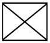
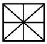
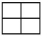
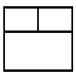
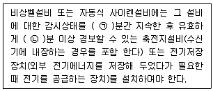
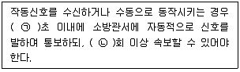

# 소방설비기사(전기분야)20200606(해설집) - 소방전기시설의 구조 및원리

> 원본: `소방설비기사(전기분야)20200606(해설집).pdf`
> 개인학습용 변환본.

## 61. 문제

61. 소방시설용 비상전원수전설비의 화재안전기 준(NFSC 602)
에 따라 소방시설용 비상전원 수전설비에서 소방회로 및 일
반회로 겸용의 것으로서 수전설비, 변전설비 그 밖의 기기 
및 배선을 금속제 외함에 수납한 것은?
    ① 공용분전반
② 전용배전반
    ③ 공용큐비클식
④ 전용큐비클식
<문제 해설>
1.전용큐비클식 : 소방회로만의 것으로서 수전설비, 변전설비 그 
밖의 기기 및 배선을 금속제 외함에 수납한 것을 말한다.
2.공용큐비클식 : 소방회로 및 일반회로 겸용인 것으로서 수전설
비, 변전설비 그 밖의 기기 및 배선을 금속제 외함에 수납한 것
을 말한다.
3.전용배전반 : 소방회로 전용의 것으로서 개폐기, 과전류차단
기, 계기 그 밖의 배선용기기 및 배선을 금속제 외에 수납한 것
4.공용배전반 : 소방회로 및 일반회로 공용, 위와 동일
5.전용분전반 : 소방회로 전용의 것으로서 분기개폐기, 분기과전
류차단기 그 밖의 배선용기기 및 배선을 금속제외함에 수납한 
것을 말한다.
6.공용분전반 : 소방회로 및 일반회로 겸용, 위와 동일
[해설작성자 : 오키도키]

### 정답

1번

### 해설

정답은 1번입니다. 선택지의 핵심개념 을 확인하세요.

## 62. 문제

62. 비상조명등의 화재안전기준(NFSC 304)에 따른 비상조명등
의 시설기준에 적합하지 않은 것은?
    ① 조도는 비상조명등이 설치된 장소의 각 부분의 바닥에서 
0.5lx가 되도록 하였다.
    ② 특정소방대상물의 각 거실과 그로부터 지상에 이르는 복
도·계단 및 그 밖의 통로에 설치하였다.
    ③ 예비전원을 내장하는 비상조명등에 평상시 점등여부를 
확인할 수 있는 점검스위치를 설치하였다.
4과목 : 소방전기시설의 구조 및 원리

본 해설집은 최강 자격증 기출문제 전자문제집 CBT 해설달기 프로젝트에 의해서 만들어진 자료입니다. 해설을 제공해 주신 모든 분들께 감사 드립니다.
소방설비기사(전기분야)
◐2020년 06월 06일 필기 기출문제 및 해설집◑
전자문제집 CBT : www.comcbt.com
기출문제 해설은 최강 자격증 기출문제 전자문제집 CBT : www.comcbt.com 통해서 실시간으로 변경됩니다.
    ④ 예비전원을 내장하는 비상조명등에 해당 조명등을 유효
하게 작동시킬 수 있는 용량의 축전지와 예비전원 충전
장치를 내장하도록 하였다.
<문제 해설>
조도는 비상조명등이 설치된 장소의 각 부분의 바닥에서 1㏓ 이
상이 되도록 할 것
[해설작성자 : 소방초보]

### 정답

1번

### 해설

정답은 1번입니다. 선택지의 핵심개념 을 확인하세요.

## 63. 문제

63. 자동화재탐지설비 및 시각경보장치의 화재안전기준(NFSC 
203)에 따른 공기관식 차동식분포형 감지기의 설치기준으로 
틀린 것은?
    ① 검출부는 3° 이상 경사되지 아니하도록 부착할 것
    ② 공기관의 노출부분은 감지구역마다 20m 이상이 되도록 
할 것
    ③ 하나의 검출부분에 접속하는 공기관의 길이는 100m 이
하로 할 것
    ④ 공기관과 감지구역의 각 변과의 수평거리는 1.5m 이하
가 되도록 할 것
<문제 해설>
[공기관식 차동식분포형감지기 설치기준]
​가. 공기관의 노출부분은 감지구역마다 20m 이상이 되도록 할 
것
나. 공기관과 감지구역의 각 변과의 수평거리는 1.5m 이하가 되
도록 하고, 공기관 상호간의 거리는 6m(주요 구조부를 내화구조
로한 특정소방대상물 또는 그 부분에 있어서는 9m) 이하가 되
도록 할 것
다..공기관은 도중에서 분기하지 아니하도록 할 것
라. 하나의 검출부분에 접속하는 공기관의 길이는 100m 이하로 
할 것
마. 검출부는 5° 이상 경사되지 아니하도록 부착할 것
바. 검출부는 바닥으로부터 0.8m 이상 1.5m 이하의 위치에 설
치할 것
[출처] 제7조 제3항 제7호 차동식분포형감지기 설치기준 [공기
관식, 열전대식, 열반도체식]|작성자 자장구
[해설작성자 : 소방초보]

### 정답

1번

### 해설

정답은 1번입니다. 선택지의 핵심개념 을 확인하세요.

## 64. 문제

64. 무선통신보조설비의 화재안전기준(NFSC 505)에 따라 무선
통신보조설비의 주회로 전원이 정상인지 여부를 확인하기 
위해 증폭기의 전면에 설치하는 것은?
    ① 상순계
    ② 전류계
    ③ 전압계 및 전류계
    ④ 표시등 및 전압계
<문제 해설>
증폭기 및 무선중계기의 설치기준(NFPC 505 8조, NFTC 505 
2.5.1)
(1) 전원은 축전지, 전기저정장치 또는    교류전압 옥내간선으
로 하고, 전원까지의 배선은 전용으로 할 것.
(2) 증폭기의 전면에는 전원확인 표시등 및 전압계를 설치 할 
것.
(30 증폭기의 비상전원 용량은 30분 이상일 것
[해설작성자 : 죽음의 사자]

### 정답

1번

### 해설

정답은 1번입니다. 선택지의 핵심개념 을 확인하세요.

## 65. 문제

65. 유도등 및 유도표지의 화재안전기준(NFSC 303)에 따라 지
하층을 제외한 층수가 11층 이상인 특정소방대상물의 유도
등의 비상전원을 축전지로 설치한다면 피난층에 이르는 부
분의 유도등을 몇 분 이상 유효하게 작동 시킬 수 있는 용
량으로 하여야 하는가?
    ① 10
② 20
    ③ 50
④ 60
<문제 해설>
11층 이상
지하층 무창층으로 도소매시장 / 여객자동차터미널 / 지하 역사,
상가 는 60분이상
[해설작성자 : 와우어둠땅하고파]

### 정답

1번

### 해설

정답은 1번입니다. 선택지의 핵심개념 을 확인하세요.

## 66. 문제

66. 비상경보설비 및 단독경보형감지기의 화재안전기준(NFSC 
201)에 따라 바닥면적이 450m2일 경우 단독경보형감지기의 
최소 설치개수는?
    ① 1개
② 2개
    ③ 3개
④ 4개
<문제 해설>
450/150 = 3
[해설작성자 : 레인]
제5조(단독경보형감지기) 단독경보형감지기는 다음 각호의 기준
에 따라 설치하여야 한다.

### 정답

1번

### 해설

정답은 1번입니다. 선택지의 핵심개념 을 확인하세요.

## 67. 문제

67. 비상방송설비의 배선공사 종류 중 합성수지관공사에 대한 
설명으로 틀린 것은?(문제 오류로 가답안 발표시 4번으로 
발표되었지만 확정답안 발표시 2, 4번이 정답처리 되었습니
다. 여기서는 가답안인 4번을 누르시면 정답 처리 됩니다.)
    ① 금속관 공사에 비해 중량이 가벼워 시공이 용이하다.
    ② 절연성이 있어 누전의 우려가 없기 때문에 접지공사가 
필요치 않다.

본 해설집은 최강 자격증 기출문제 전자문제집 CBT 해설달기 프로젝트에 의해서 만들어진 자료입니다. 해설을 제공해 주신 모든 분들께 감사 드립니다.
소방설비기사(전기분야)
◐2020년 06월 06일 필기 기출문제 및 해설집◑
전자문제집 CBT : www.comcbt.com
기출문제 해설은 최강 자격증 기출문제 전자문제집 CBT : www.comcbt.com 통해서 실시간으로 변경됩니다.
    ③ 열에 약하며, 기계적 충격 및 중량물에 의한 압력 등 외
력에 약하다.
    ④ 내식성이 있어 부식성 가스가 체류하는 화학공장 등에 
적합하며, 금속관과 비교하여 가격이 비싸다.
<문제 해설>
합성수지관공사는 금속관과 비교했을때 가격이 더욱 싸다.
[해설작성자 : 뭐]

### 정답

1번

### 해설

정답은 1번입니다. 선택지의 핵심개념 을 확인하세요.

## 68. 문제

68. 자동화재탐지설비 및 시각경보장치의 화재안전기준(NFSC 
203)에 따라 자동화재탐지설비에서 4층 이상의 특정소방대
상물에는 어떤 기기와 전화통화가 가능한 수신기를 설치하
여야 하는가?(관련 규정 개정전 문제로 여기서는 기존 정답
인 1번을 누르면 정답 처리됩니다. 자세한 내용은 해설을 
참고하세요.)
    ① 발신기
② 감지기
    ③ 중계기
④ 시각경보장치
<문제 해설>
아래와 같은 오류 신고가 있었습니다.
여러분들의 많은 의견 부탁 드립니다.
추후 여러분들의 의견을 반영하여 정답을 수정하도록 하겠습니
다.
참고로 정답 변경은 오류 신고 5회 이상일 경우 수정합니다.
[오류 신고 내용]
2022년 법 개정으로 해당 규정 삭제되어 정답없음
[해설작성자 : 하기시룸]
성안당 7일 끝장합격 23년도에 나온 내용입니다.
해당 68번 문제는 수신기 설치에서 청각장애인용 시각경보장치
의 설치높이(단, 천장의 높이가 2m인 경우)
라는 문제로 바뀌었습니다
[해설작성자 : 이니셜d 아케이드 하고싶다..]

### 정답

1번

### 해설

정답은 1번입니다. 선택지의 핵심개념 을 확인하세요.

## 69. 문제

69. 비상경보설비 및 단독경보형감지기의 화재안전기준(NFSC 
201)에 따라 비상경보설비의 발신기 설치 시 복도 또는 별
도로 구획된 실로서 보행거리가 몇 m 이상일 경우에는 추
가로 설치하여야 하는가?
    ① 25
② 30
    ③ 40
④ 50
<문제 해설>
복도 또는 별도로 구획 >>>>>>>> 40m 그냥외워버리자
보통 기출단골은 유도표지(15m), 복도통로유도등/거실통로유도
등/3종연기감지기(20m), 1,2종연기감지기(30m), 무선기기접속단
자(300m)이게 많이 나왔을것임
[해설작성자 : 와우어둠땅하고파]
발신기는 수평거리 25m마다 설치하지만, 복도 또는 별도로 구
획한 실이라는 단어가 나올 경우에는 무조건 보행거리 40m마다 
추가로 설치해야한다.
[해설작성자 : 승리부대]

### 정답

1번

### 해설

정답은 1번입니다. 선택지의 핵심개념 을 확인하세요.

## 70. 문제

70. 비상방송설비의 화재안전기준(NFSC 202)에 따라 비상방송
설비에서 기동장치에 따른 화재신고를 수신한 후 필요한 음
량으로 화재 발생 상황 및 피난에 유효한 방송이 자동으로 
개시될 때까지의 소요시간은 몇 초 이하로 하여야 하는가?
    ① 5
② 10
    ③ 15
④ 20
<문제 해설>
화재 발생 상황 및 피난에 유효한 방송이 자동으로 개시될 때까
지의 소요시간은 10초입니다(19.04.24)
[해설작성자 : 몰라알수가없어]

### 정답

1번

### 해설

정답은 1번입니다. 선택지의 핵심개념 을 확인하세요.

## 71. 문제

71. 비상콘센트설비의 화재안전기준(NFSC 504) 에 따른 비상콘
센트의 시설기준에 적합하지 않은 것은?
    ① 바닥으로부터 높이 1.45m에 움직이지 않게 고정시켜 설
치된 경우
    ② 바닥면적이 800m2인 층의 계단의 출입구로부터 4m에 
설치된 경우
    ③ 바닥면적의 합계가 12,000m2 인 지하상가의 수평거리 
30m마다 추가 설치된 경우
    ④ 바닥면적의 합계가 2,500m2 인 지하층의 수평거리 40m
마다 추가로 설치한 경우
<문제 해설>
⑤ 비상콘센트는 다음 각호의 기준에 따라 설치하여야 한다..

### 정답

1번

### 해설

정답은 1번입니다. 선택지의 핵심개념 을 확인하세요.

## 72. 문제

72. 누전경보기의 형식승인 및 제품검사의 기술 기준에 따라 누
전경보기의 수신부는 그 정격전압에서 몇 회의 누전작동시
험을 실시하는가?
    ① 1,000회
② 5,000회
    ③ 10,000회
④ 20,000회
<문제 해설>
누전경보기 제작 업체 사장인 김주한 은
누전경보기는 실제 1만번 시험을 해야 상품의 가치가 있다고 발
언
2008년 05월 13일 그 의미를 알리고자 해당제품을 필요로 하는 
고객 1만명에게 무료로 배포함

본 해설집은 최강 자격증 기출문제 전자문제집 CBT 해설달기 프로젝트에 의해서 만들어진 자료입니다. 해설을 제공해 주신 모든 분들께 감사 드립니다.
소방설비기사(전기분야)
◐2020년 06월 06일 필기 기출문제 및 해설집◑
전자문제집 CBT : www.comcbt.com
기출문제 해설은 최강 자격증 기출문제 전자문제집 CBT : www.comcbt.com 통해서 실시간으로 변경됩니다.
[해설작성자 : 리]

### 정답

1번

### 해설

정답은 1번입니다. 선택지의 핵심개념 을 확인하세요.

### 그림

## 73. 문제

73. 무선통신보조설비의 화재안전기준(NFSC 505) 에 따라 서로 
다른 주파수의 합성된 신호를 분리하기 위하여 사용하는 장
치는?
    ① 분배기
② 혼합기
    ③ 증폭기
④ 분파기
<문제 해설>
나눌 분
주파수의 파
>> 분파기
[해설작성자 : 와우어둠땅하고파]

### 정답

1번

### 해설

정답은 1번입니다. 선택지의 핵심개념 을 확인하세요.

### 그림

## 74. 문제

74. 비상콘센트설비의 화재안전기준(NFSC 504) 에 따라 비상콘
센트설비의 전원부와 외함 사이의 절연저항은 전원부와 외
함 사이를 500V 절연저항계로 측정할 때 몇 ㏁ 이상 이어
야 하는가?
    ① 20
② 30
    ③ 40
④ 50
<문제 해설>
급하다면 요것만 기억
250V 측정기 → 0.1[㏁]
500V 측정기 → 20[㏁]
[해설작성자 : 와우어둠땅하고파]
누전경보기는 500V 측정기 → 5[㏁]입니다
[해설작성자 : 보다가]

### 정답

1번

### 해설

정답은 1번입니다. 선택지의 핵심개념 을 확인하세요.

### 그림

## 75. 문제

75. 비상경보설비의 구성요소로 옳은 것은?(문제 오류로 가답안 
발표시 2번으로 발표되었지만 확정답안 발표시 모두 정답처
리 되었습니다. 여기서는 가답안인 2번을 누르면 정답 처리 
됩니다.)
    ① 기동장치, 경종, 화재표시등, 전원
    ② 전원, 경종, 기동장치, 위치표시등
    ③ 위치표시등, 경종, 화재표시등, 전원
    ④ 경종, 기동장치, 화재표시등, 위치표시등
<문제 해설>
비상벨
ㆍ기동장치, 음향장치, 표시등, 비상전원, 배선으로 구성
ㆍ일반적으로 발신기세트(경종, 표시등, 발신기)을 사용함.
ㆍ기동장치는 발신기세트의 누름스위치를 사용
자동식사이렌
ㆍ발신기세트의 경종대신 사이렌이 사용됨
[해설작성자 : 푸른마을 안전관리자]

### 정답

1번

### 해설

정답은 1번입니다. 선택지의 핵심개념 을 확인하세요.

### 그림

## 76. 문제

76. 수신기를 나타내는 소방시설 도시기호로 옳은 것은?
    ① 
② 
    ③ 
④ 
<문제 해설>
2 - 수신기
3 - 부수신기
4 - 중계기
[해설작성자 : 대천사.루시퍼]

### 정답

1번

### 해설

정답은 1번입니다. 선택지의 핵심개념 을 확인하세요.

### 그림

## 77. 문제

77. 비상경보설비 및 단독경보형감지기의 화재안전기준(NFSC 
201)에 따른 비상벨설비 또는 자동식 사이렌설비에 대한 설
명이다. 다음 ( )의 ㉠, ㉡에 들어갈 내용으로 옳은 것은?
    
    ① ㉠ 30, ㉡ 10
② ㉠ 60, ㉡ 10
    ③ ㉠ 30, ㉡ 20
④ ㉠ 60, ㉡ 20
<문제 해설>
화재안전기준 제4조(비상벨설비 또는 자동식사이렌설비)
⑦ 비상벨설비 또는 자동식사이렌설비에는 그 설비에 대한 감시
상태를 [60분간] 지속한 후 유효하게 [10분 이상] 경보할 수 
있는 축전지설비(수신기에 내장하는 경우를 포함한다) 또는 전기
저장장치(외부 전기에너지를 저장해 두었다가 필요한 때 전기를 
공급하는 장치)를 설치하여야 한다..다만, 상용전원이 축전지설
비인 경우 또는 건전지를 주전원으로 사용하는 무선식 설비인 
경우에는 그러하지 아니하다..<개정 2019. 5. 24.>
[해설작성자 : 꿈돌이소금빵]

### 정답

1번

### 해설

정답은 1번입니다. 선택지의 핵심개념 을 확인하세요.

### 그림

## 78. 문제

78. 비상경보설비 및 단독경보형감지기의 화재안전기준(NFSC 
201)에 따라 비상벨설비 또는 자동식 사이렌설비의 전원회
로 배선 중 내열배선에 사용하는 전선의 종류가 아닌 것은?
    ① 버스덕트(Bus Duct)
    ② 600V 1종 비닐절연전선
    ③ 0.6/1kV EP 고무절연 클로로프렌 시스 케이블
    ④ 450/750V 저독성 난연 가교 폴리올레핀 절연전선
<문제 해설>
쉽게 생각하면 비닐절연전선의 비닐이면 열에 버티기 조금 힘들
겠네??
[해설작성자 : 와우어둠땅하고파]
내열배선 사용 전선의 종류:

### 정답

1번

### 해설

정답은 1번입니다. 선택지의 핵심개념 을 확인하세요.

### 그림

## 79. 문제

79. 자동화재탐지설비 및 시각경보장치의 화재안전기준(NFSC 
203)에 따라 감지기 회로의 도통시험을 위한 종단저항의 설
치기준으로 틀린 것은?
    ① 동일층 발신기함 외부에 설치할 것
    ② 점검 및 관리가 쉬운 장소에 설치할 것
    ③ 전용함을 설치하는 경우 그 설치 높이는 바닥으로부터 
1.5m 이내로 할 것
    ④ 종단감지기에 설치할 경우에는 구별이 쉽도록 해당 감지
기의 기판 등에 별도의 표시를 할 것
<문제 해설>
발신기함 내부에 설치할 것
[해설작성자 : 와우어둠땅하고파]

### 정답

1번

### 해설

정답은 1번입니다. 선택지의 핵심개념 을 확인하세요.

### 그림

## 80. 문제

80. 자동화재속보설비의 속보기의 성능인증 및 제품검사의 기술
기준에 따른 자동화재속보설비의 속보기에 대한 설명이다. 
다음 ( )의 ㉠, ㉡에 들어갈 내용으로 옳은 것은?
    
    ① ㉠ 20, ㉡ 3
② ㉠ 20, ㉡ 4
    ③ ㉠ 30, ㉡ 3
④ ㉠ 30, ㉡ 4
<문제 해설>
제5조(기능) 속보기는 다음에 적합한 기능을 가져야 한다.

### 정답

1번

### 해설

정답은 1번입니다. 선택지의 핵심개념 을 확인하세요.

### 그림

