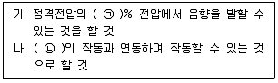
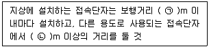

# 소방설비기사(전기분야)20200822(해설집) - 소방전기시설의 구조 및원리

> 원본: `소방설비기사(전기분야)20200822(해설집).pdf`
> 개인학습용 변환본.

## 61. 문제

61. 자동화재속보설비의 속보기의 성능인증 및 제품검사의 기술
기준에 따라 교류입력측과 외함 간의 절연저항은 직류 
500V의 절연저항계로 측정한 값이 몇 MΩ 이상이어야 하는
가?
    ① 5
② 10
    ③ 20
④ 50
<문제 해설>
자동화재속보설비 절연저항시험

### 정답

1번

### 해설

정답은 1번입니다. 선택지의 핵심개념 을 확인하세요.

## 62. 문제

62. 무선통신보조설비의 화재안전기준(NFSC 505)에 따라 금속
제 지지금구를 사용하여 무선통신 보조설비의 누설동축케이
블을 벽에 고정시키고자 하는 경우 몇 m 이내마다 고정시
켜야 하는가? (단, 불연재료로 구획된 반자 안에 설치하는 
경우는 제외한다.)
    ① 2
② 3
    ③ 4
④ 5
<문제 해설>
누설동축케이블 설치기준
- 소방전용
- 4m 이내마다 금속제 또는 자기제 등으로 견고하게 고정시킬
것
- 고압의 전로로부터 1.5m 이상 떨어진 위치 (정전기 차폐장치 
한 경우 제외)
- 임피던스 50옴
무선기 접속단자 설치기준
4과목 : 소방전기시설의 구조 및 원리

본 해설집은 최강 자격증 기출문제 전자문제집 CBT 해설달기 프로젝트에 의해서 만들어진 자료입니다. 해설을 제공해 주신 모든 분들께 감사 드립니다.
소방설비기사(전기분야)
◐2020년 08월 22일 필기 기출문제 및 해설집◑
전자문제집 CBT : www.comcbt.com
기출문제 해설은 최강 자격증 기출문제 전자문제집 CBT : www.comcbt.com 통해서 실시간으로 변경됩니다.
- 보행거리 300m 이내 다른 용도와 5m 이상 거리를 둘 것
[해설작성자 : comcbt.com 이용자]

### 정답

1번

### 해설

정답은 1번입니다. 선택지의 핵심개념 을 확인하세요.

### 그림

## 63. 문제

63. 비상경보설비 및 단독경보형감지기의 화재안전기준(NFSC 
201)에 따라 비상벨설비의 음향장치의 음량은 부착된 음향
장치의 중심으로부터 1m 떨어진 위치에서 몇 dB 이상이 되
는 것으로 하여야 하는가?
    ① 60
② 70
    ③ 80
④ 90
<문제 해설>
60dB - 고장 표시
70dB - 가스, 누전 표시
[해설작성자 : 안녕]

### 정답

1번

### 해설

정답은 1번입니다. 선택지의 핵심개념 을 확인하세요.

### 그림

## 64. 문제

64. 자동화재탐지설비 및 시각경보장치의 화재안전기준(NFSC 
203)에 따라 외기에 면하여 상시 개방된 부분이 있는 차고·
주차장·창고 등에 있어서는 외기에 면하는 각 부분으로부터 
몇 m 미만의 범위 안에 있는 부분은 경계구역의 면적에 산
입하지 아니 하는가?
    ① 1
② 3
    ③ 5
④ 10
<문제 해설>
③ 외기에 면하여 상시 개방된 부분이 있는 차고·주차장·창고 등
에 있어서는 외기에 면하는 각 부분으로부터 5m 미만의 범위안
에 있는 부분은 경계구역의 면적에 산입하지 아니한다.
[해설작성자 : 낙양거사]

### 정답

1번

### 해설

정답은 1번입니다. 선택지의 핵심개념 을 확인하세요.

### 그림

## 65. 문제

65. 누전경보기의 형식승인 및 제품검사의 기술기준에 따른 누
전경보기 수신부의 기능검사 항목이 아닌 것은?
    ① 충격시험
    ② 진공가압시험
    ③ 과입력전압시험
    ④ 전원전압변동시험
<문제 해설>
방수시험
충격시험
충격파내전압시험
절연내력
절연저항시험
전원전압변동시험
[해설작성자 : 레인]
전기 전자 관련제품에서 진공이나 가압의 시험이 필요하지 않을 
것으로 생각됩니다..
진공이나 가압 시험은 화학적 반응 또는 물리적 반응을 필요로 
하는 시험에 필요합니다..
[해설작성자 : comcbt.com 이용자]

### 정답

1번

### 해설

정답은 1번입니다. 선택지의 핵심개념 을 확인하세요.

### 그림

## 66. 문제

66. 비상방송설비의 화재안전기준(NFSC 202)에 따른 음향장치
의 구조 및 성능에 대한 기준이다. 다음 ( )에 들어갈 내용
으로 옳은 것은?
    
    ① ㉠ 65, ㉡ 자동화재탐지설비
    ② ㉠ 80, ㉡ 자동화재탐지설비
    ③ ㉠ 65, ㉡ 단독경보형감지기
    ④ ㉠ 80, ㉡ 단독경보형감지기
<문제 해설>
비상방송설비의화재안전기준(NFSC 202)

### 정답

1번

### 해설

정답은 1번입니다. 선택지의 핵심개념 을 확인하세요.

### 그림

## 67. 문제

67. 비상조명등의 화재안전기준(NFSC 304)에 따라 조도는 비상
조명등이 설치된 장소의 각 부분의 바닥에서 몇 lx 이상이 
되도록 하여야 하는가?
    ① 1
② 3
    ③ 5
④ 10
<문제 해설>
바닥에서 1lx이상
비상조명등의 화재안전기준(NFSC 304)
4조 조도는 비상조명등이 설치된 장소의 각 부분의 바닥에서 1
㏓ 이상이 되도록 할 것
[해설작성자 : 옥정동신똘]

### 정답

1번

### 해설

정답은 1번입니다. 선택지의 핵심개념 을 확인하세요.

### 그림

## 68. 문제

68. 비상방송설비의 화재안전기준(NFSC 202)에 따른 용어의 정
의에서 소리를 크게 하여 멀리까지 전달될 수 있도록 하는 
장치로써 일명 “스피커”를 말하는 것은?
    ① 확성기
② 증폭기
    ③ 사이렌
④ 음량조절기
<문제 해설>
확성기: 소리를 크게 하여 멀리까지 전달될 수 있도록 하는 장
치, 일명 스피커
음량조절기: 가변저항을 이용하여 전류를 변화시켜 음량을 크게 
하거나 작게 조절할 수 있는 장치
증폭기: 전압전류의 진폭을 늘려 감도를 좋게 하고 미약한 음성
전류를 커다란 음성전류로 변화시켜 소리를 크게 하는 장치
"사이렌"은 법령정의사전에 정의되지 않은 단어입니다.
대신 [비상경보설비 및 단독경보형감지기의 화재안전기준
(NFSC201)]에서
"자동식사이렌설비"를 화재발생 상황을 사이렌으로 경보하는 설
비로 정의되어있습니다.
[해설작성자 : 꿈돌이소금빵]

### 정답

1번

### 해설

정답은 1번입니다. 선택지의 핵심개념 을 확인하세요.

### 그림

## 69. 문제

69. 자동화재탐지설비 및 시각경보장치의 화재안전기준(NFSC 

본 해설집은 최강 자격증 기출문제 전자문제집 CBT 해설달기 프로젝트에 의해서 만들어진 자료입니다. 해설을 제공해 주신 모든 분들께 감사 드립니다.
소방설비기사(전기분야)
◐2020년 08월 22일 필기 기출문제 및 해설집◑
전자문제집 CBT : www.comcbt.com
기출문제 해설은 최강 자격증 기출문제 전자문제집 CBT : www.comcbt.com 통해서 실시간으로 변경됩니다.
203)에 따른 중계기에 대한 시설기준으로 틀린 것은?
    ① 조작 및 점검에 편리하고 화재 및 침수 등의 재해로 인
한 피해를 받을 우려가 없는 장소에 설치할 것
    ② 수신기에서 직접 감지기회로의 도통시험을 행하지 아니
하는 것에 있어서는 수신기와 발신기 사이에 설치할 것
    ③ 수신기에 따라 감시되지 아니하는 배선을 통하여 전력을 
공급받는 것에 있어서는 전원입력측에 배선에 과전류 차
단기를 설치할 것
    ④ 수신기에 따라 감시되지 아니하는 배선을 통하여 전력을 
공급받는 것에 있어서는 해당 전원의 정전이 즉시 수신
기에 표시되는 것으로 할 것
<문제 해설>

### 정답

1번

### 해설

정답은 1번입니다. 선택지의 핵심개념 을 확인하세요.

### 그림

## 70. 문제

70. 비상콘센트설비의 화재안전기준(NFSC 504)에 따라 비상콘
센트용의 풀박스 등은 방청도장을 한 것으로서, 두께 몇 
mm 이상의 철판으로 하여야 하는가?
    ① 1.2
② 1.6
    ③ 2.0
④ 2.4
<문제 해설>
비상콘센트 1.6mm
자동화재속보설비1.2mm(합성수지3mm)
[해설작성자 : 이도한]
비상콘센트 1.6mm
자동화재속보설비 1.2mm(합성수지3mm)
발신기(강판) 1.2 mm(합성수지 3mm)
            (강판 매립시 매립되는 외함부분 1.6mm이상)
[해설작성자 : 주땡땡]
외함 두께의 정리
- 발신기/속보기: 1.2mm, 매립 시 1.6mm
- 누전경보기: 1.0mm, 매립 시 1.6mm
- 비상콘센트: 1.6mm
- 큐비클: 2.3mm
- 1종 분전반, 배전반: 1.6mm(전면판 및 문 2.3mm)
[해설작성자 : Junny Cho]

### 정답

1번

### 해설

정답은 1번입니다. 선택지의 핵심개념 을 확인하세요.

## 71. 문제

71. 누전경보기의 형식승인 및 제품검사의 기술기준에 따라 누
전경보기의 변류기는 경계전로에 정격전류를 흘리는 경우, 
그 경계전로의 전압강하는 몇 V 이하이어야 하는가? (단, 
경계전로의 전선을 그 변류기에 관통시키는 것은 제외한다.)
    ① 0.3
② 0.5
    ③ 1.0
④ 3.0
<문제 해설>
누전경보기의 형식승인 및 제품검사의 기술기준[시행 2018. 3. 
12.]
제22조(전압강하방지시험)
변류기(경계전로의 전선을 그 변류기에 관통시키는 것은 제외한
다)는 경계전로에 정격전류를 흘리는 경우, 그 경계전로의 전압
강하는 0.5 V이하이어야 한다..
[해설작성자 : 꿈돌이소금빵]

### 정답

1번

### 해설

정답은 1번입니다. 선택지의 핵심개념 을 확인하세요.

## 72. 문제

72. 자동화재탐지설비 및 시각경보장치의 화재안전기준(NFSC 
203)에 따른 배선의 시설기준으로 틀린 것은?
    ① 감지기 사이의 회로의 배선은 송배전식으로 할 것
    ② 자동화재탐지설비의 감지기 회로의 전로저항은 50Ω 이
하가 되도록 할 것
    ③ 수신기의 각 회로별 종단에 설치되는 감지기에 접속되는 
배선의 전압은 감지기 정격전압의 80% 이상이어야 할 
것
    ④ 피(P)형 수신기 및 지피(G.P.)형 수신기의 감지기 회로의 
배선에 있어서 하나의 공통선에 접속할 수 있는 경계구
역은 10개 이하로 할 것
<문제 해설>
10개 -> 7개
[해설작성자 : 레인]

### 정답

1번

### 해설

정답은 1번입니다. 선택지의 핵심개념 을 확인하세요.

## 73. 문제

73. 예비전원의 성능인증 및 제품검사의 기술기준에 따른 예비
전원의 구조 및 성능에 대한 설명으로 틀린 것은?
    ① 예비전원을 병렬로 접속하는 경우에는 역충전방지 등의 
조치를 강구하여야 한다.
    ② 배선은 충분한 전류 용량을 갖는 것으로서 배선의 접속
이 적합하여야 한다.
    ③ 예비전원에 연결되는 배선의 경우 양극은 청색, 음극은 
적색으로 오접속방지 조치를 하여야 한다.
    ④ 축전지를 직렬 또는 병렬로 사용하는 경우에는 용량(전
압, 전류)이 균일한 축전지를 사용하여야 한다.
<문제 해설>

### 정답

1번

### 해설

정답은 1번입니다. 선택지의 핵심개념 을 확인하세요.

## 74. 문제

74. 비상콘센트설비의 성능인증 및 제품검사의 기술기준에 따라 
비상콘센트설비에 사용되는 부품에 대한 설명으로 틀린 것
은?
    ① 진공차단기는 KS C 8321(진공차단기)에 적합하여야 한
다.
    ② 접속기는 KS C 8305(배선용 꽂음 접속기)에 적합하여야 
한다.
    ③ 표시등의 소켓은 접속이 확실하여야 하며 쉽게 전구를 
교체할 수 있도록 부착하여야 한다.
    ④ 단자는 충분한 전류용량을 갖는 것으로 하여야 하며 단
자의 접속이 정확하고 확실하여야 한다.
<문제 해설>
KS C 8321 -> 배선차단기
[해설작성자 : 레인]
비상콘센트설비의 성능인증 및 제품검사의 기술기준[시행 2019.

### 정답

1번

### 해설

정답은 1번입니다. 선택지의 핵심개념 을 확인하세요.

## 75. 문제

75. 소방시설용 비상전원수전설비의 화재안전기준(NFSC 602)에 
따른 제1종 배전반 및 제1종 분전반의 시설기준으로 틀린 
것은?
    ① 전선의 인입구 및 입출구는 외함에 노출하여 설치하면 
아니 된다.
    ② 외함의 문은 2.3mm 이상의 강판과 이와 동등 이상의 강
도와 내화성능이 있는 것으로 제작하여야 한다.
    ③ 공용배전판 및 공용분전판의 경우 소방회로와 일반회로
에 사용하는 배선 및 배선용 기기는 불연재료로 구획되
어야 한다.
    ④ 외함은 금속관 또는 금속제 가요전선관을 쉽게 접속할 
수 있도록 하고, 당해 접속부분에는 단열조치를 하여야 
한다.
<문제 해설>
외함에 노출하여 설치할 수 있는 것
1.표시등(불연성 또는 난연성재료로 덮개를 설치한 것에 한함)
2.전선의 인입구 및 인출구
3.환기장치
4.전압계(퓨즈 등으로 보호한 것에 한함)
5.전류계(변류기의 2차측에 접속된 것에 한함)
6.계기용 전환스위치(불연성 또는 난연성재료로 제작된 것에 한
함)
[해설작성자 : 익명]

### 정답

1번

### 해설

정답은 1번입니다. 선택지의 핵심개념 을 확인하세요.

### 그림

## 76. 문제

76. 비상경보설비 및 단독경보형감지기의 화재안전기준(NFSC 
201)에 따른 발신기의 시설기준으로 틀린 것은?
    ① 발신기의 위치표시등은 함의 하부에 설치한다.
    ② 조작스위치는 바닥으로부터 0.8m 이상 1.5m 이하의 높
이에 설치할 것
    ③ 복도 또는 별도로 구획된 실로서 보행거리가 40m 이상
일 경우에는 추가로 설치하여야 한다.
    ④ 특정소방대상물의 층마다 설치하되, 해당 특정소방대상
물의 각 부분으로부터 하나의 발신기까지의 수평거리가 
25m 이하가 되도록 할 것
<문제 해설>

### 정답

1번

### 해설

정답은 1번입니다. 선택지의 핵심개념 을 확인하세요.

### 그림

## 77. 문제

77. 유도등의 형식승인 및 제품검사의 기술기준에 따른 유도등
의 일반구조에 대한 설명으로 틀린 것은?
    ① 축전지에 배선 등을 직접 납땜하지 아니하여야 한다.
    ② 충전부가 노출되지 아니한 것은 300V를 초과할 수 있다.
    ③ 예비전원을 직렬로 접속하는 경우는 역충전 방지 등의 
조치를 강구하여야 한다.
    ④ 유도등에는 점멸, 음성 또는 이와 유사한 방식 등에 의
한 유도장치를 설치할 수 있다.
<문제 해설>
직렬 -> 병렬
[해설작성자 : 레인]

### 정답

1번

### 해설

정답은 1번입니다. 선택지의 핵심개념 을 확인하세요.

### 그림

## 78. 문제

78. 자동화재탐지설비 및 시각경보장치의 화재안전기준(NFSC 
203)에 따라 지하층·무장층 등으로서 환기가 잘되지 아니하
거나 실내 면적이 40m2 미만인 장소에 설치하여야 하는 적
응성이 있는 감지기가 아닌 것은?
    ① 불꽃감지기
    ② 광전식분리형감지기
    ③ 정온식스포트형감지기
    ④ 아날로그방식의 감지기
<문제 해설>

### 정답

1번

### 해설

정답은 1번입니다. 선택지의 핵심개념 을 확인하세요.

### 그림

## 79. 문제

79. 무선통신보조설비의 화재안전기준(NFSC 505)에 따른 무선
기기의 접속단자에 대한 시설기준이다. 다음 ( )에 들어갈 
내용으로 옳은 것은?
    
    ① ㉠ 300, ㉡ 3
② ㉠ 300, ㉡ 5
    ③ ㉠ 500, ㉡ 3
④ ㉠ 500, ㉡ 5
<문제 해설>
지상에 설치하는 접속단자는 보행거리 300m 이내마다 설치하
고, 다른 용도로 사용되는 접속단자에서 5m 이상의 거리를 둘 
것
[해설작성자 : 주식회사 파인텍]

본 해설집은 최강 자격증 기출문제 전자문제집 CBT 해설달기 프로젝트에 의해서 만들어진 자료입니다. 해설을 제공해 주신 모든 분들께 감사 드립니다.
소방설비기사(전기분야)
◐2020년 08월 22일 필기 기출문제 및 해설집◑
전자문제집 CBT : www.comcbt.com
기출문제 해설은 최강 자격증 기출문제 전자문제집 CBT : www.comcbt.com 통해서 실시간으로 변경됩니다.

### 정답

1번

### 해설

정답은 1번입니다. 선택지의 핵심개념 을 확인하세요.

### 그림

## 80. 문제

80. 유도등 및 유도표지의 화재안전기준(NFSC 303)에 따른 피
난구유도등의 설치장소로 틀린 것은?
    ① 직통계단
    ② 직통계단의 계단실
    ③ 안전구획된 거실로 통하는 출입구
    ④ 옥외로부터 직접 지하로 통하는 출입구
<문제 해설>
피난유도등인데 밖으로 안내해야지 지하로 유도하면 안되겟쥬..
[해설작성자 : 레인]
본 해설집의 저작권은 www.comcbt.com에 있으며
카페, 블로그 등의 업로드 및 개인적 활용 이외에
문서의 수정 및 DB 저장, 기타 금전적 이익을 취하는
일체의 행위를 금지 합니다.
전자문제집 CBT 홈페이지 : www.comcbt.com
기출문제 및 해설집 다운로드 : www.comcbt.com/xe
전자문제집 CBT 앱(구글플레이) : [다운로드]
전자문제집 CBT란?
인터넷으로 종이 없이 문제를 풀고 자동채점하는 프로그램으로 
워드, 컴활, 기능사 등의 상설검정에서 사용하는 실제 프로그램 
방식입니다.
해설을 제공하며 PC 버전 및 모바일 버전 완벽 연동
교사용/학생용 관리기능도 제공합니다.
오답 및 오탈자가 수정된 최신 자료와 해설은 전자문제집 CBT 
에서 확인하세요.
1
2
3
4
5
6
7
8
9
10
②
④
②
④
④
①
②
③
④
③
11
12
13
14
15
16
17
18
19
20
③
①
③
④
②
③
①
②
②
①
21
22
23
24
25
26
27
28
29
30
②
③
②
④
④
②
②
②
①
①
31
32
33
34
35
36
37
38
39
40
①
④
②
④
③
②
①
②
③
②
41
42
43
44
45
46
47
48
49
50
③
④
④
③
④
③
①
④
②
③
51
52
53
54
55
56
57
58
59
60
①
①
②
①
③
②
②
②
④
②
61
62
63
64
65
66
67
68
69
70
③
③
④
③
②
②
①
①
②
②
71
72
73
74
75
76
77
78
79
80
②
④
③
①
①
①
③
③
②
④

### 정답

1번

### 해설

정답은 1번입니다. 선택지의 핵심개념 을 확인하세요.
