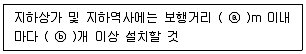
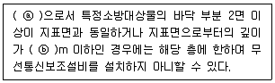
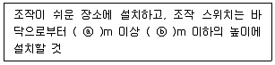
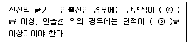

# 소방설비기사(전기분야)20200926(해설집) - 소방전기시설의 구조 및원리

> 원본: `소방설비기사(전기분야)20200926(해설집).pdf`
> 개인학습용 변환본.

## 61. 문제

61. 비상경보설비 및 단독경보형감지기의 화재안전기준(NFSC 
201)에 따라 화재신호 및 상태신호 등을 송수신하는 방식으
로 옳은 것은?
    ① 자동식
② 수동식
    ③ 반자동식
④ 유·무선식
<문제 해설>
제3조의2(신호처리방식) 화재신호 및 상태신호 등(이하 "화재신
호 등"이라 한다)을 송수신하는 방식은 다음 각 호와 같다..<개
정 2019. 5. 24.>

### 정답

1번

### 해설

정답은 1번입니다. 선택지의 핵심개념 을 확인하세요.

## 62. 문제

62. 감지기의 형식승인 및 제품검사의 기술기준에 따른 연기감
4과목 : 소방전기시설의 구조 및 원리

본 해설집은 최강 자격증 기출문제 전자문제집 CBT 해설달기 프로젝트에 의해서 만들어진 자료입니다. 해설을 제공해 주신 모든 분들께 감사 드립니다.
소방설비기사(전기분야)
◐2020년 09월 26일 필기 기출문제 및 해설집◑
전자문제집 CBT : www.comcbt.com
기출문제 해설은 최강 자격증 기출문제 전자문제집 CBT : www.comcbt.com 통해서 실시간으로 변경됩니다.
지기의 종류로 옳은 것은?
    ① 연복합형
    ② 공기흡입형
    ③ 차동식스포트형
    ④ 보상식스포트형
<문제 해설>
연기 감지기 종류
이온화식 스포트형, 광전식 스포트형, 광전식 분리형, 공기 흡입
형등이 있다
[해설작성자 : 건축 전기 설비 기술사]
<추가>
① 연    복    합    형 : 이온화식 + 광전식감지기의 성능이 
있는 것으로서 두 가지 성능이 함께 작동 될 때 화재신호를 발
신
③ 차동식 스포트형 : 주위 온도가 일정 상승률 이상이 되면 작
동
④ 보상식 스포트형 : 차동식+ 정온식 기능이 동시에 내장
[해설작성자 : AHS]

### 정답

1번

### 해설

정답은 1번입니다. 선택지의 핵심개념 을 확인하세요.

### 그림

## 63. 문제

63. 비상콘센트설비의 화재안전기준(NFSC 504)에 따른 비상콘
센트설비의 전원회로(비상콘센트에 전력을 공급하는 회로를 
말한다)의 시설기준으로 옳은 것은?
    ① 하나의 전용회로에 설치하는 비상콘센트는 12개 이하로 
할 것
    ② 전원회로는 단상교류 220V인 것으로서, 그 공급용량은 
1.0kVA 이상인 것으로 할 것
    ③ 비상콘센트용의 풀박스 등은 방청도장을 한 것으로서, 
두께 1.2mm 이상의 철판으로 할 것
    ④ 전원으로부터 각 층의 비상콘센트에 분기 되는 경우에는 
분기배선용 차단기를 보호함 안에 설치할 것
<문제 해설>
ㅇ비상콘센트설비의 설치기준(화재안전기준 제4조)
1.단상교류220V, 1.5KVA이상
2.주배전반에서 전용회로로 할 것

### 정답

1번

### 해설

정답은 1번입니다. 선택지의 핵심개념 을 확인하세요.

### 그림

## 64. 문제

64. 비상방송설비의 화재안전기준(NFSC 202)에 따라 기동장치
에 따른 화재신고를 수신한 후필요한 음량으로 화재발생 상
황 및 피난에 유효한 방송이 자동으로 개시될 때까지의 소
요시간은 몇 초 이하로 하여야 하는가?
    ① 3
② 5
    ③ 7
④ 10
<문제 해설>
소요시간
p형,r형 등 - 5초 미만
중계기 - 5초 미만
비상방송설비 - 10초 이하
가스누설경보기 - 60초 미만
[해설작성자 : 와수베]

### 정답

1번

### 해설

정답은 1번입니다. 선택지의 핵심개념 을 확인하세요.

### 그림

## 65. 문제

65. 비상조명등의 화재안전기준(NFSC 304)에 따른 휴대용비상
조명등의 설치기준이다. 다음 ( )에 들어갈 내용으로 옳은 
것은?
    
    ① ⓐ 25, ⓑ 1
② ⓐ 25, ⓑ 3
    ③ ⓐ 50, ⓑ 1
④ ⓐ 50, ⓑ 3
<문제 해설>
사람많은 도매시장, 영화관    50마다 3개 이상
지하상가 지하역사 는 25마다 3개 이상
[해설작성자 : comcbt.com 이용자]

### 정답

1번

### 해설

정답은 1번입니다. 선택지의 핵심개념 을 확인하세요.

### 그림

## 66. 문제

66. 자동화재탐지설비 및 시각경보장치의 화재안전기준(NFSC 
203)에 따른 자동화재탐지설비의 중계기의 시설기준으로 틀
린 것은?
    ① 조작 및 점검에 편리하고 화재 및 침수 등의 재해로 인
한 피해를 받을 우려가 없는 장소에 설치할 것
    ② 수신기에서 직접 감지기회로의 도통시험을 행하지 아니
하는 것에 있어서는 수신기와 감지기 사이에 설치할 것
    ③ 감지기에 따라 감시되지 아니하는 배선을 통하여 전력을 
공급받는 것에 있어서는 전원입력측의 배선에 누전경보
기를 설치할 것
    ④ 수신기에 따라 감시되지 아니하는 배선을 통하여 전력을 
공급받는 것에 있어서는 해당 전원의 정전이 즉시 수신
기에 표시되는 것으로 할 것
<문제 해설>
수신기에 따라 감시되지 아니하는 배선을 통하여 전력을 공급받
는것에 있어서는 전원 입력측의 배선에 과전류차단기를 설치할
것
[해설작성자 : 건축전기설비기술사]

### 정답

1번

### 해설

정답은 1번입니다. 선택지의 핵심개념 을 확인하세요.

### 그림

## 67. 문제

67. 자동화재탐지설비 및 시각경보장치의 화재안전기준(NFSC 
203)에 따라 부착높이 8m 이상 15m 미만에 설치 가능한 
감지기가 아닌 것은?
    ① 불꽃감지기
    ② 보상식 분포형감지기
    ③ 차동식 분포형감지기
    ④ 광전식 분리형 1종 감지기
<문제 해설>
ㅇ8m 이상 15m 미만 설치 가능 감지기
- 차동식 분포형, 이온화식1종,2종, 광전1종,2종 , 연기복합형,
불꽃 감지기
[해설작성자 : 박길로이]
불꽃감지기는 모든 높이에 설치 가능.
그래서 8~15m에도 설치 가능.
[해설작성자 : 포레스트]

본 해설집은 최강 자격증 기출문제 전자문제집 CBT 해설달기 프로젝트에 의해서 만들어진 자료입니다. 해설을 제공해 주신 모든 분들께 감사 드립니다.
소방설비기사(전기분야)
◐2020년 09월 26일 필기 기출문제 및 해설집◑
전자문제집 CBT : www.comcbt.com
기출문제 해설은 최강 자격증 기출문제 전자문제집 CBT : www.comcbt.com 통해서 실시간으로 변경됩니다.
보상식 분포형이라는것은 없고 보상식 스포트형(4~8) 이라는것
은 있습니다
차동식 분포형은 4~8 미만으로 정답은 2번 차동식 분포형입니
다
[해설작성자 : 전기~]
2번 차동식 분포형아니고 보상식 분포형(4 ~ 8m 미만)입니다.
[해설작성자 : choti]
8m이상 15 m미만 설치 가능한 감지기

### 정답

1번

### 해설

정답은 1번입니다. 선택지의 핵심개념 을 확인하세요.

### 그림

## 68. 문제

68. 예비전원의 성능인증 및 제품검사의 기술기준에서 정의하는 
"예비전원"에 해당하지 않는 것은?
    ① 리튬계 2차 축전지
    ② 알카리계 2차 축전지
    ③ 용융염 전해질 연료전지
    ④ 무보수 밀폐형 연축전지
<문제 해설>
리튬계 2차, 알칼리 2차, 무보수 밀폐형 연축전지 : 예비전원
[해설작성자 : 지피지기]

### 정답

1번

### 해설

정답은 1번입니다. 선택지의 핵심개념 을 확인하세요.

### 그림

## 69. 문제

69. 누전경보기의 형식승인 및 제품검사의 기술기준에 따라 누
전경보기에서 사용되는 표시등에 대한 설명으로 틀린 것은?
    ① 지구등은 녹색으로 표시되어야 한다.
    ② 소켓은 접촉이 확실하여야 하며 쉽게 전구를 교체할 수 
있도록 부착하여야 한다.
    ③ 주위의 밝기가 300lx인 장소에서 측정하여 앞면으로부터 
3m 떨어진 곳에서 켜진 등이 확실히 식별되어야 한다.
    ④ 전구는 사용전압의 130%인 교류전압을 20시간 연속하여 
가하는 경우 단선, 현저한 광속변화, 흑화, 전류의 저하 
등이 발생하지 아니하여야 한다.
<문제 해설>
마. 누전화재의 발생을 표시하는 표시등(이하 "누전등"이라 한
다)이 설치된 것은 등이 켜질 때 적색으로 표시되어야 하며, 누
전화재가 발생한 경계전로의 위치를 표시하는 표시등(이하 "지구
등"이라 한다)과 기타의 표시등은 다음과 같아야 한다
[해설작성자 : 낙양거사]
누전등,지구등 : 적색
기타 표시등 : 적색 외의 색
[해설작성자 : 빵빵이]

### 정답

1번

### 해설

정답은 1번입니다. 선택지의 핵심개념 을 확인하세요.

### 그림

## 70. 문제

70. 비상콘센트설비의 화재안전기준(NFSC 504)에 따라 아파트 
또는 바닥면적이 1000m2 미만인 층은 비상콘센트를 계단의 
출입구로부터 몇 m 이내에 설치해야 하는가? (단, 계단의 
부속실을 포함하며 계단이 2 이상 있는 경우에는 그 중 1개
의 계단을 말한다.)
    ① 10
② 8
    ③ 5
④ 3
<문제 해설>
아파트 바닥면적 1000 이상 계단부속실 출입구로부터 5m 이내
아파트 바닥면적 1000 미만 계단의 출입구로부터 5m 이내
'5m'
[해설작성자 : 영햄]

### 정답

1번

### 해설

정답은 1번입니다. 선택지의 핵심개념 을 확인하세요.

### 그림

## 71. 문제

71. 무선통신보조설비의 화재안전기준(NFSC 505)에 따른 설치
제외에 대한 내용이다. 다음 ( )에 들어갈 내용으로 옳은 것
은?
    
    ① ⓐ 지하층, ⓑ 1
② ⓐ 지하층, ⓑ 2
    ③ ⓐ 무창층, ⓑ 1
④ ⓐ 무창층, ⓑ 2
<문제 해설>
1번
무선통신보조설비의 화재안전성능기준(NFPC 505) [시행 2022.

### 정답

1번

### 해설

정답은 1번입니다. 선택지의 핵심개념 을 확인하세요.

### 그림

## 72. 문제

72. 비상방송설비의 화재안전기준(NFSC 202)에 따른 정의에서 
가변저항을 이용하여 전류를 변화시켜 음량을 크게 하거나 
작게 조절할 수 있는 장치를 말하는 것은?
    ① 증폭기
② 변류기
    ③ 중계기
④ 음량조절기
<문제 해설>
가변저항을 이용하여 전류를 변화시켜 음량을 크게 하거나 작게 
조절할 수 있는 장치 : 음량조절기
[해설작성자 : 대천사.루시퍼]
증폭기 : 소리를 키워주는 것
변류기 : 누설된 전류를 검출
중계기 : 신호를 변환
[해설작성자 : 포레스트]

### 정답

1번

### 해설

정답은 1번입니다. 선택지의 핵심개념 을 확인하세요.

### 그림

## 73. 문제

73. 소방시설용 비상전원수전설비의 화재안전기준(NFSC 602)에 
따라 큐비클형의 시설기준으로 틀린 것은?
    ① 전용큐비클 또는 공용큐비클식으로 설치할 것
    ② 외함은 건축물의 바닥 등에 견고하게 고정할 것
    ③ 자연환기구에 따라 충분히 환기할 수 없는 경우에는 환
기설비를 설치할 것

본 해설집은 최강 자격증 기출문제 전자문제집 CBT 해설달기 프로젝트에 의해서 만들어진 자료입니다. 해설을 제공해 주신 모든 분들께 감사 드립니다.
소방설비기사(전기분야)
◐2020년 09월 26일 필기 기출문제 및 해설집◑
전자문제집 CBT : www.comcbt.com
기출문제 해설은 최강 자격증 기출문제 전자문제집 CBT : www.comcbt.com 통해서 실시간으로 변경됩니다.
    ④ 공용큐비클식의 소방회로와 일반회로에 사용되는 배선 
및 배선용기기는 난연재료로 구획할 것
<문제 해설>

### 정답

1번

### 해설

정답은 1번입니다. 선택지의 핵심개념 을 확인하세요.

### 그림

## 74. 문제

74. 비상경보설비 및 단독경보형감지기의 화재안전기준(NFSC 
201)에 따른 발신기의 시설기준에 대한 내용이다. 다음 ( )
에 들어갈 내용으로 옳은 것은?
    
    ① ⓐ 0.6, ⓑ 1.2
② ⓐ 0.8, ⓑ 1.5
    ③ ⓐ 1.0, ⓑ 1.8
④ ⓐ 1.2, ⓑ 2.0
<문제 해설>
조작이 쉬운 장소에 설치하고 조작 스위치는 바닥으로부터 
0.8~1.5m 이내에 설치한다.
[해설작성자 : gudtjr35791]

### 정답

1번

### 해설

정답은 1번입니다. 선택지의 핵심개념 을 확인하세요.

### 그림

## 75. 문제

75. 누전경보기의 형식승인 및 제품검사의 기술기준에 따라 누
전경보기에 차단기구를 설치하는 경우 차단기구에 대한 설
명으로 틀린 것은?
    ① 개폐부는 정지점이 명확하여야 한다.
    ② 개폐부는 원활하고 확실하게 작동하여야 한다.
    ③ 개폐부는 KS C 8321(배선용차단기)에 적합한 것이어야 
한다.
    ④ 개폐부는 수동으로 개폐되어야 하며 자동적으로 복귀하
지 아니하여야 한다.
<문제 해설>

### 정답

1번

### 해설

정답은 1번입니다. 선택지의 핵심개념 을 확인하세요.

### 그림

## 76. 문제

76. 감지기의 형식승인 및 제품검사의 기술기준에 따른 단독경
보형감지기(주전원이 교류전원 또는 건전지인 것을 포함한
다)의 일반기능에 대한 설명으로 틀린 것은?
    ① 작동되는 경우 작동표시등에 의하여 화재의 발생을 표시
할 수 있는 기능이 있어야 한다.
    ② 작동되는 경우 내장된 음향장치의 명동에 의하여 화재경
보음을 발할 수 있는 기능이 있어야 한다.
    ③ 전원의 정상상태를 표시하는 전원표시등의 섬광주기는 3
초 이내의 점등과 60초 이내의 소등으로 이루어져야 한
다.
    ④ 자동복귀형 스위치(자동적으로 정위치에 복귀될 수 있는 
스위치를 말한다)에 의하여 수동으로 작동시험을 할 수 
있는 기능이 있어야 한다.
<문제 해설>
주기적으로 섬광하는 전원표시등에 의하여 전원의 정상 여부를 
감시할 수 있는 기능
이 있어야 하며, 전원의 정상상태를 표시하는 전원표시등의 섬
광주기는 1초 이내의
점등과 30초에서 60초 이내의 소등으로 이루어져야 한다.
[해설작성자 : 낙양거사]

### 정답

1번

### 해설

정답은 1번입니다. 선택지의 핵심개념 을 확인하세요.

### 그림

## 77. 문제

77. 자동화재속보설비의 속보기의 성능인증 및 제품검사의 기술
기준에 따라 자동화재속보설비의 속보기가 소방관서에 자동
적으로 통신망을 통해 통보하는 신호의 내용으로 옳은 것
은?
    ① 당해 소방대상물의 위치 및 규모
    ② 당해 소방대상물의 위치 및 용도
    ③ 당해 화재발생 및 당해 소방대상물의 위치
    ④ 당해 고장발생 및 당해 소방대상물의 위치
<문제 해설>
자동화재속보설비의 속보기의 성능인증 및 제품검사의 기술기준
2조2항에
자동화재속보설비의속보기(이하 이 기준에서 "속보기"라 한다)"
란 수동작동 및 자동화재탐지설비 수신기의 화재신호와 연동으
로 작동하여 관계인에게 화재발생을 경보함과 동시에 소방관서
에 자동적으로 통신망을 통한 당해 화재발생 및 당해 소방대상
물의 위치 등을 음성으로 통보하여 주는 것을 말한다.
[해설작성자 : 옥정동신똘]

### 정답

1번

### 해설

정답은 1번입니다. 선택지의 핵심개념 을 확인하세요.

### 그림

## 78. 문제

78. 유도등의 우수품질인증 기술기준에 따른 유도등의 일반구조
에 대한 내용이다. 다음 ( )에 들어갈 내용으로 옳은 것은?
    
    ① ⓐ 0.75, ⓑ 0.5
② ⓐ 0.75, ⓑ 0.75
    ③ ⓐ 1.5, ⓑ 0.75
④ ⓐ 2.5, ⓑ 1.5
<문제 해설>
유도등의 일반구조

### 정답

1번

### 해설

정답은 1번입니다. 선택지의 핵심개념 을 확인하세요.

### 그림

## 79. 문제

79. 유도등 및 유도표지의 화재안전기준(NFSC 303)에 따라 객
석유도등을 설치하여야 하는 장소로 틀린 것은?
    ① 벽
② 천장
    ③ 바닥
④ 통로
<문제 해설>
"객석유도등"이란 객석의 통로, 바닥 또는 벽에 설치하는 유도등
을 말한다
[해설작성자 : 주식회사 파인텍]
천장을 보며 대피가 가능할까요?
[해설작성자 : 깨스보이]

### 정답

1번

### 해설

정답은 1번입니다. 선택지의 핵심개념 을 확인하세요.

## 80. 문제

80. 무선통신보조설비의 화재안전기준(NFSC 505)에 따라 누설
동축케이블 또는 동축케이블의 임피던스는 몇 Ω 인가?
    ① 5
② 10
    ③ 30
④ 50
<문제 해설>
무선통신보조설비의 분배기.분파기.혼합기 설치기준
1임피던스 50옴의것
2점검이 편리하고 화재등의 피해우려가 없는장소
3먼지.습기.부식등에 이상이 없을것
[해설작성자 : 파몽]
본 해설집의 저작권은 www.comcbt.com에 있으며
카페, 블로그 등의 업로드 및 개인적 활용 이외에
문서의 수정 및 DB 저장, 기타 금전적 이익을 취하는
일체의 행위를 금지 합니다.
전자문제집 CBT 홈페이지 : www.comcbt.com
기출문제 및 해설집 다운로드 : www.comcbt.com/xe
전자문제집 CBT 앱(구글플레이) : [다운로드]
전자문제집 CBT란?
인터넷으로 종이 없이 문제를 풀고 자동채점하는 프로그램으로 
워드, 컴활, 기능사 등의 상설검정에서 사용하는 실제 프로그램 
방식입니다.
해설을 제공하며 PC 버전 및 모바일 버전 완벽 연동
교사용/학생용 관리기능도 제공합니다.
오답 및 오탈자가 수정된 최신 자료와 해설은 전자문제집 CBT 
에서 확인하세요.
1
2
3
4
5
6
7
8
9
10
④
③
④
③
④
③
①
①
④
③
11
12
13
14
15
16
17
18
19
20
①
③
④
④
②
①
③
①
②
③
21
22
23
24
25
26
27
28
29
30
③
①
①
③
④
③
②
④
③
②
31
32
33
34
35
36
37
38
39
40
②
②
②
③
②
①
③
③
①
③
41
42
43
44
45
46
47
48
49
50
④
④
③
①
③
③
②
①
①
③
51
52
53
54
55
56
57
58
59
60
①
①
④
②
②
②
④
③
③
④
61
62
63
64
65
66
67
68
69
70
④
②
④
④
②
③
②
③
①
③
71
72
73
74
75
76
77
78
79
80
①
④
④
②
③
③
③
①
②
④

### 정답

1번

### 해설

정답은 1번입니다. 선택지의 핵심개념 을 확인하세요.
