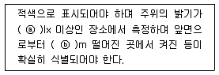
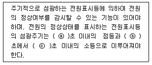
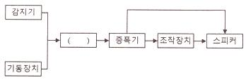
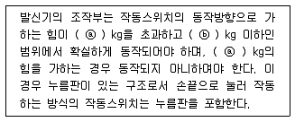
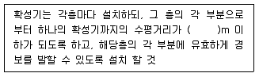

# 소방설비기사(전기분야)20210515(교사용) - 소방전기시설의 구조 및원리

> 원본: `소방설비기사(전기분야)20210515(교사용).pdf`
> 개인학습용 변환본.

## 61. 문제

61. 비상콘센트설비의 화재안전기준(NFSC 504)에 따라 하나의 
전용회로에 단상교류 비상콘센트 6개를 연결하는 경우, 전
선의 용량은 몇 kVA 이상이어야 하는가?
    ① 1.5
② 3
    ③ 4.5
④ 9
<문제 해설>
하나의 전용회로에 설치하는 비상콘센트는 10개 이하로 할 것. 
이 경우 전선의 용량은 각 비상콘센트(비상콘센트가 3개 이상인 
경우에는 3개)의 공급용량을 합한 용량 이상의 것으로 하여야 
한다.
[출처] 비상콘센트설비의 화재안전기준(NFSC 504)
[해설작성자 : Tony Kim]
비상콘센트 1개의 용량 1.5kva
[해설작성자 : 공부중]
전용회로에 단상 비콘 6개 연결한다
1.5x3=4.5
[해설작성자 : 리]
설명은 이해가 가도록 쉽게
콘센트1개 = 1.5kva, 콘센트2개 = 3kva, 콘센트3개 이상 = 
4.5kva 임.
[해설작성자 : 초보]

### 정답

1번

### 해설

정답은 1번입니다. 선택지의 핵심개념 을 확인하세요.

## 62. 문제

62. 무선통신보조설비의 화재안전기준(NFSC 505)에 따라 지표
면으로부터의 깊이가 몇m 이하인 경우에는 해당층에 한하
여 무선통신보조설비를 설치하지 아니할 수 있는가?
    ① 0.5
② 1
    ③ 1.5
④ 2
<문제 해설>
무선 통신 보조 설비의 설치 제외

### 정답

1번

### 해설

정답은 1번입니다. 선택지의 핵심개념 을 확인하세요.

## 63. 문제

63. 자동화재속보설비의 속보기의 성능인증 및 제품검사의 기술
기준에 따른 속보기의 구조에 대한 설명으로 틀린 것은?
    ① 수동통화용 송수화장치를 설치하여야 한다
    ② 접지전극에 직류전류를 통하는 회로방식을 사용하여야 
한다
    ③ 작동 시 그 작동시간과 작동회수를 표시할 수 있는 장치
를 하여야 한다
    ④ 예비전원회로에는 단락사고 등을 방지하기 위한 퓨즈, 
차단기 등과 같은 보호장치를 하여야 한다
<문제 해설>
직류전류 - >교류전류
[해설작성자 : comcbt.com 이용자]

### 정답

1번

### 해설

정답은 1번입니다. 선택지의 핵심개념 을 확인하세요.

## 64. 문제

64. 공기관식 차동식 분포형감지기의 기능시험을 하였더니 검출
기의 접점수고치가 규정이상으로 되어 있었다. 이때 발생되
는 장애로 볼 수 있는 것은?
    ① 작동이 늦어진다.
    ② 장애는 발생되지 않는다.
    ③ 동작이 전혀 되지 않는다.
4과목 : 소방전기시설의 구조 및 원리

본 해설집은 최강 자격증 기출문제 전자문제집 CBT 해설달기 프로젝트에 의해서 만들어진 자료입니다. 해설을 제공해 주신 모든 분들께 감사 드립니다.
소방설비기사(전기분야)
◐2021년 03월 07일 필기 기출문제 및 해설집◑
전자문제집 CBT : www.comcbt.com
기출문제 해설은 최강 자격증 기출문제 전자문제집 CBT : www.comcbt.com 통해서 실시간으로 변경됩니다.
    ④ 화재도 아닌데 작동하는 일이 있다.
<문제 해설>
규정 이상을 경우 작동이 늦어짐 (둔해짐)
규정 이하일 경우 화재가 아닌데 작동하는 경우가 잇음(오동작) 
(민감해짐)
[해설작성자 : JW]
정상일 경우 : "장애는 발생되지 않는다."
비정상일 경우 : 감지기가 "작동되지 않는다."
규정 이하일 경우 : 감지기가 예민하여 "화재가 아닌데 작동하는 
일이 발생한다."
규정 이상일 경우 : 감지기 감도가 저하되어 "작동이 늦어진다."
[해설작성자 : 고듬이]

### 정답

1번

### 해설

정답은 1번입니다. 선택지의 핵심개념 을 확인하세요.

## 65. 문제

65. 경종의 형식승인 및 제품검사의 기술기준에 따라 경종은 전
원전압이 정격전압의 ± 몇%범위에서 변동하는 경우 기능에 
이상이 생기지 아니하여야 하는가?
    ① 5
② 10
    ③ 20
④ 30
<문제 해설>
경종의 형식승인 및 제품검사의 기술기준
제4조(전원전압변동시의 기능) 경종은 전원전압이 정격전압의 ± 
20 % 범위에서 변동하는 경우 기능에 이상이 생기지 아니하여
야 한다.
[해설작성자 : 대천사.루시퍼]

### 정답

1번

### 해설

정답은 1번입니다. 선택지의 핵심개념 을 확인하세요.

## 66. 문제

66. 누전경보기의 화재안전기준(NFSC 205)에 따라 누전경보기
의 수신부를 설치할 수 있는 장소는? (단, 해당 누전경보기
에 대하여 방폭ㆍ방식ㆍ방습ㆍ방온ㆍ방진 및 정전기 차폐등
의 방호조치를 하지 않은 경우이다.)
    ① 습도가 낮은 장소
    ② 온도의 변화가 급격한 장소
    ③ 화약류를 제조하거나 저장 또는 취급하는 장소
    ④ 부식성의 증기ㆍ가스 등이 다량으로 체류하는 장소
<문제 해설>
누전경보기의 화재안전기준(NFSC 205)
제5조(수신부)
② 누전경보기의 수신부는 다음 각 호의 [장소 외]의 장소에 설
치하여야 한다..다만, 해당 누전경보기에 대하여 방폭·방식·방습·
방온·방진 및 정전기 차폐 등의 방호조치를 한 것은 그러하지 
아니하다..

### 정답

1번

### 해설

정답은 1번입니다. 선택지의 핵심개념 을 확인하세요.

## 67. 문제

67. 자동화재탐지설비 및 시각경보장치의 화재안전기준(NFSC 
203)에 따라 특정소방대상물 중 화재신호를 발신하고 그 신
호를 수신 및 유효하게 제어할 수 있는 구역을 무엇이라 하
는가?
    ① 방호구역
② 방수구역
    ③ 경계구역
④ 화재구역
<문제 해설>
자동화재탐지설비 및 시각경보장치의 화재제3조(정의) 이 기준
에서 사용하는 용어의 정의는 다음과 같다.

### 정답

1번

### 해설

정답은 1번입니다. 선택지의 핵심개념 을 확인하세요.

## 68. 문제

68. 소방시설용 비상전원수전설비의 화재안전기준(NFSC 602) 
용어의 정의에 따라 수용장소의 조영물(토지에 정착한 시설
물 중 지붕 및 기둥 또는 벽이 있는 시설물을 말한다.)의 옆
면 등에 시설하는 전선으로서 그 수용장소의 인입구에 이르
는 부분의 전선은 무엇인가?
    ① 인입선
② 내화배선
    ③ 열화배선
④ 인입구배선
<문제 해설>
소방시설용 비상전원수전설비의 화재안전기준(NFSC 602)
제3조(정의) 이 기준에서 사용되는 용어의 정의는 다음과 같
다.

### 정답

1번

### 해설

정답은 1번입니다. 선택지의 핵심개념 을 확인하세요.

## 69. 문제

69. 비상콘센트설비의 성능인증 및 제품검사의 기술기준에 따른 

본 해설집은 최강 자격증 기출문제 전자문제집 CBT 해설달기 프로젝트에 의해서 만들어진 자료입니다. 해설을 제공해 주신 모든 분들께 감사 드립니다.
소방설비기사(전기분야)
◐2021년 03월 07일 필기 기출문제 및 해설집◑
전자문제집 CBT : www.comcbt.com
기출문제 해설은 최강 자격증 기출문제 전자문제집 CBT : www.comcbt.com 통해서 실시간으로 변경됩니다.
표시등의 구조 및 기능에 대한 내용이다. 다음 ( )에 들어갈 
내용으로 옳은 것은?
    
    ① ⓐ 100, ⓑ 1
② ⓐ 300, ⓑ 3
    ③ ⓐ 500, ⓑ 5
④ ⓐ 1000, ⓑ 10
<문제 해설>
비상콘센트설비의 성능인증 및 제품검사의 기술기준
제4조(부품의 구조 및 기능) 비상콘센트설비에 다음 각 호의 부
품을 사용하는 경우 해당 각호의 규정에 적합하거나 이와 동등
이상의 성능이 있는 것이어야 한다.

### 정답

1번

### 해설

정답은 1번입니다. 선택지의 핵심개념 을 확인하세요.

### 그림

## 70. 문제

70. 감지기의 형식승인 및 제품검사의 기술기준에 따라 단독경
보형감지기의 일반기능에 대한 내용이다. 다음 ( )에 들어갈 
내용으로 옳은 것은?
    
    ① ⓐ 1, ⓑ 15, ⓒ 60
    ② ⓐ 1, ⓑ 30, ⓒ 60
    ③ ⓐ 2, ⓑ 15, ⓒ 60
    ④ ⓐ 2, ⓑ 30, ⓒ 60
<문제 해설>
감지기의 형식승인 및 제품검사의 기술기준
제5조의2(단독경보형감지기의 일반기능) 단독경보형의 감지기(주
전원이 교류전원 또는 건전지인 것을 포함한다)는 다음 각 호에 
적합하여야 한다.

### 정답

1번

### 해설

정답은 1번입니다. 선택지의 핵심개념 을 확인하세요.

### 그림

## 71. 문제

71. 일반적인 비상방송설비의 계통되다. 다음의 ( )에 들어갈 내
용으로 옳은 것은?
    
    ① 변류기
② 발신기
    ③ 수신기
④ 음향장치
<문제 해설>
비상방송설비 계통도
감지기+기동장치 → 수신기 → 증폭기(→스피커) → 조작장치 
→ 스피커
실기 단답 문제
[해설작성자 : 영햄]

### 정답

1번

### 해설

정답은 1번입니다. 선택지의 핵심개념 을 확인하세요.

### 그림

## 72. 문제

72. 자동화재탐지설비 및 시각경보장치의 화재안전기준(NFSC 
203)에 따라 자동화재탐지설비의 주음향장치의 설치 장소로 
옳은 것은?
    ① 발신기의 내부
    ② 수신기의 내부
    ③ 누전경보기의 내부
    ④ 자동화재속보설비의 내부
<문제 해설>
자동화재탐지설비 감지기가 작동하면 화재경보 소리를 내는 벨
을 음향장치라 한다..
수신기의 내부 또는 그 부근에 설치된 벨을 주음향자치라 하고, 
각 층의 발신기에 설치된 벨을 지구음향장치라 한다..
수신기의 내부 또는 그 직근(가까운 곳)에 설치한다
[해설작성자 : 영햄]

### 정답

1번

### 해설

정답은 1번입니다. 선택지의 핵심개념 을 확인하세요.

### 그림

## 73. 문제

73. 비상조명등의 형식승인 및 제품검사의 기술기준에 따라 비
상조명등의 일반구조로 광원과 전원부를 별도로 수납하는 
구조에 대한 설명으로 틀린 것은?
    ① 전원함은 방폭구조로 할 것
    ② 배선은 충분히 견고한 것을 사용 할 것
    ③ 광원과 전원부 사이의 배선길이는 1m 이하로 할 것
    ④ 전원함은 불연재료 또는 난연재료의 재질을 사용할 것
<문제 해설>
광원과 전원부를 별도로 수납하는 구조인 것을 다음 각목에 적
합하여야 한다.
가. 전원함은 불연재료 또는 난연재료의 재질을 사용할 것
나. 광원과 전원부 사이의 배선길이는 1 m이하로 할 것
다..배선은 충분히 견고한 것을 사용할 것
[해설작성자 : 영햄]

### 정답

1번

### 해설

정답은 1번입니다. 선택지의 핵심개념 을 확인하세요.

### 그림

## 74. 문제

74. 누전경보기의 형식승인 및 제품검사의 기술기준에 따라 누

본 해설집은 최강 자격증 기출문제 전자문제집 CBT 해설달기 프로젝트에 의해서 만들어진 자료입니다. 해설을 제공해 주신 모든 분들께 감사 드립니다.
소방설비기사(전기분야)
◐2021년 03월 07일 필기 기출문제 및 해설집◑
전자문제집 CBT : www.comcbt.com
기출문제 해설은 최강 자격증 기출문제 전자문제집 CBT : www.comcbt.com 통해서 실시간으로 변경됩니다.
전경보기에 사용되는 표시등의 구조 및 기능에 대한 설명으
로 틀린 것은?
    ① 누전등이 설치된 수신부의 지구등은 적색외의 색으로도 
표시할 수 있다.
    ② 방전등 또는 발광다이오드의 경우 전구는 2개 이상을 병
렬로 접속하여야 한다
    ③ 소켓은 접촉이 확실하여야 하며 쉽게 전구를 교체할 수 
있도록 부착하여야 한다.
    ④ 누전등 및 지구등과 쉽게 구별할 수 있도록 부착된 기타
의 표시등은 적색으로도 표시할 수 있다.
<문제 해설>

### 정답

1번

### 해설

정답은 1번입니다. 선택지의 핵심개념 을 확인하세요.

### 그림

## 75. 문제

75. 유도등의 형식승인 및 제품검사의 기술기준에 따라 영상표
시소자(LED, LCD 및 PDP 등)를 이용하여 피난유도표시 형
상을 영상으로 구현하는 방식은?
    ① 투광식
② 패널식
    ③ 방폭형
④ 방수형
<문제 해설>
유도등의 형식승인 및 제품검사의 기술기준
제2조(용어의 정의) 이 기준에서 사용하는 용어의 정의는 다음
과 같다.

### 정답

1번

### 해설

정답은 1번입니다. 선택지의 핵심개념 을 확인하세요.

### 그림

## 76. 문제

76. 발신기의 형식승인 및 제품검사의 기술기준에 따라 발신기
의 작동기능에 대한 내용이다. 다음 ( )에 들어갈 내용으로 
옳은 것은?
    
    ① ⓐ 2, ⓑ 8
② ⓐ 3, ⓑ 7
    ③ ⓐ 2, ⓑ 7
④ ⓐ 3, ⓑ 8
<문제 해설>
발신기의 형식승인 및 제품검사의 기술기준
제4조의2(발신기의 작동기능)     ① 발신기의 조작부는 작동스
위치의 동작방향으로 가하는 힘이 2 ㎏을 초과하고 8 ㎏이하인 
범위에서 확실하게 동작되어야 하며, 2 ㎏의 힘을 가하는 경우 
동작되지 아니하여야 한다..이 경우 누름판이 있는 구조로서 손
끝으로 눌러 작동하는 방식의 작동스위치는 누름판을 포함한다..
[해설작성자 : 대천사.루시퍼]

### 정답

1번

### 해설

정답은 1번입니다. 선택지의 핵심개념 을 확인하세요.

### 그림

## 77. 문제

77. 유도등의 형식승인 및 제품검사의 기술기준에 따라 객석유
도등은 바닥면 또는 디딤바닥면에서 높이 0.5m의 위치에 
설치하고 그 유도등의 바로 밑에서 0.3m 떨어진 위치에서
의 수평조도가 몇 lx 이상이어야 하는가?
    ① 0.1
② 0.2
    ③ 0.5
④ 1
<문제 해설>
계단통로유도등은 바닥면 또는 디딤바닥 면으로부터 높이 2.5 
m의 위치에 그 유도등을 설치하고 그 유도등의 바로 밑으로부
터 수평거리로 10 m 떨어진 위치에서의 법선조도가 0.5 ㏓ 이
상
복도통로유도등은 바닥면으로부터 1 m 높이에, 거실통로유도등
은 바닥면으로부터 2 m 높이에 설치하고 그 유도등의 중앙으로
부터 0.5 m 떨어진 위치의 바닥면 조도와 유도등의 전면 중앙
으로부터 0.5 m 떨어진 위치의 조도가 1 ㏓ 이상이어야 한다..
다만, 바닥면에 설치하는 통로유도등은 그 유도등의 바로 윗부
분 1 m의 높이에서 법선조도가 1 ㏓ 이상이어야 한다.
객석유도등은 바닥면 또는 디딤 바닥면에서 높이 0.5 m의 위치
에 설치하고 그 유도등의 바로 밑에서 0.3 m 떨어진 위치에서
의 수평조도가 0.2 ㏓ 이상
[해설작성자 : 영햄]

### 정답

1번

### 해설

정답은 1번입니다. 선택지의 핵심개념 을 확인하세요.

### 그림

## 78. 문제

78. 무선통신보조설비의 화재안전기준(NFSC 505)에 따라 무선
통신보조설비의 주요구성요소가 아닌 것은?
    ① 증폭기

본 해설집은 최강 자격증 기출문제 전자문제집 CBT 해설달기 프로젝트에 의해서 만들어진 자료입니다. 해설을 제공해 주신 모든 분들께 감사 드립니다.
소방설비기사(전기분야)
◐2021년 03월 07일 필기 기출문제 및 해설집◑
전자문제집 CBT : www.comcbt.com
기출문제 해설은 최강 자격증 기출문제 전자문제집 CBT : www.comcbt.com 통해서 실시간으로 변경됩니다.
    ② 분배기
    ③ 음향장치
    ④ 누설동축케이블
<문제 해설>
무선통신보조설비의 주요구성요소 : 증폭기, 분배기, 누설동축케
이블, 무선기접속단자함, 무반사종단저항
[해설작성자 : 관동폭주연합]
음향장치는 무선통신보조설비가 아니라 자동화재탐지설비의 구
성요소이다.
[해설작성자 : 참억울하거등요]

### 정답

1번

### 해설

정답은 1번입니다. 선택지의 핵심개념 을 확인하세요.

### 그림

## 79. 문제

79. 소방시설용 비상전원수전설비의 화재안전기준(NFSC 602)에 
따라 일반전기사업자로부터 특별고압 또는 고압으로 수전하
는 비상전원 수전설비로 큐비클형을 사용하는 경우의 시설
기준으로 틀린 것은? (단, 옥내에 설치하는 경우이다.)
    ① 외함은 내화성능이 있는 것으로 제작 할 것
    ② 전용큐비클 또는 공용큐비클식으로 설치할 것
    ③ 개구부에는 갑종방화문 또는 병종방화문을 설치할 것
    ④ 외함은 두께 2.3mm 이상의 강판과 이와 동등 이상의 강
도를 가질 것
<문제 해설>
개구부에는 갑종방화문 또는 을종방화문을 설치할 것
[해설작성자 : 솔잎공주]
방화문은 60분 +방화문, 60분 방화문, 30분 방화문으로 변경
[해설작성자 : 빛나는샤이니]

### 정답

1번

### 해설

정답은 1번입니다. 선택지의 핵심개념 을 확인하세요.

### 그림

## 80. 문제

80. 비상방송설비의 화재안전기준에 따른 비상방송설비의 음향
장치에 대한 내용이다. 다음 ( )에 들어갈 내용으로 옳은 것
은?
    
    ① 10
② 15
    ③ 20
④ 25
<문제 해설>
비상방송설비의 화재안전기준(NFSC 202)
제4조(음향장치) 비상방송설비는 다음 각 호의 기준에 따라 설
치하여야 한다..이 경우 엘리베이터 내부에는 별도의 음향장치를 
설치할 수 있다.

### 정답

1번

### 해설

정답은 1번입니다. 선택지의 핵심개념 을 확인하세요.

### 그림

