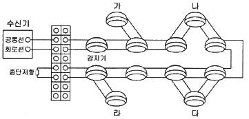
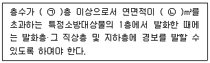
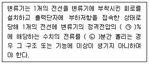
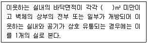

# 소방설비기사(전기분야)20210912(해설집) - 소방전기시설의 구조 및원리

> 원본: `소방설비기사(전기분야)20210912(해설집).pdf`
> 개인학습용 변환본.

## 61. 문제

61. 감지기의 형식승인 및 제품검사의 기술기준에 따라 단독경
보형감지기를 스위치 조작에 의하여 화재경보를 정지 시킬 
경우 화재경보 정지 후 몇 분 이내에 화재경보 정지기능이 
자동적으로 해제되어 정상상태로 복귀되어야 하는가?
    ① 3
② 5
    ③ 10
④ 15
<문제 해설>
감지기의 형식승인 및 제품검사의 기술기준
제5조의2(단독경보형감지기의 일반기능) 단독경보형의 감지기(주
전원이 교류전원 또는 건전지인 것을 포함한다)는 다음 각 호에 
적합하여야 한다.

### 정답

1번

### 해설

정답은 1번입니다. 선택지의 핵심개념 을 확인하세요.

## 62. 문제

62. 비상콘센트설비의 화재안전기준(NFSC 504)에 따라 하나의 
전용회로에 설치하는 비상콘센트는 몇 개 이하로 하여야 하
는가?
    ① 2
② 3
    ③ 10
④ 20
<문제 해설>
비상콘센트설비의 화재안전기준(NFSC 504)
제4조(전원 및 콘센트 등)
② 비상콘센트설비의 전원회로(비상콘센트에 전력을 공급하는 
회로를 말한다)는 다음 각 호의 기준에 따라 설치하여야 한다.

### 정답

1번

### 해설

정답은 1번입니다. 선택지의 핵심개념 을 확인하세요.

## 63. 문제

63. 자동화재속보설비의 속보기의 성능인증 및 제품검사의 기술
기준에 따라 속보기는 작동신호를 수신하거나 수동으로 동
작시키는 경우 20초 이내에 소방관서에 자동적으로 신호를 
발하여 통보하되, 몇 회 이상 속보할 수 있어야 하는가?
    ① 1
② 2
    ③ 3
④ 4
<문제 해설>
자동화재속보설비의 속보기의 성능인증 및 제품검사의 기술기준
제5조(기능) 속보기는 다음에 적합한 기능을 가져야 한다.

### 정답

1번

### 해설

정답은 1번입니다. 선택지의 핵심개념 을 확인하세요.

## 64. 문제

64. 자동화재탐지설비 및 시각경보장치의 화재안전기준(NFSC 
203)에 따른 감지기의 설치 제외 장소가 아닌 것은?
    ① 실내의 용적이 20m3 이하인 장소
    ② 부식성가스가 체류하고 있는 장소
    ③ 목욕실·욕조나 샤워시설이 있는 화장실·기타 이와 유사한 
4과목 : 소방전기시설의 구조 및 원리

본 해설집은 최강 자격증 기출문제 전자문제집 CBT 해설달기 프로젝트에 의해서 만들어진 자료입니다. 해설을 제공해 주신 모든 분들께 감사 드립니다.
소방설비기사(전기분야)
◐2021년 09월 12일 필기 기출문제 및 해설집◑
전자문제집 CBT : www.comcbt.com
기출문제 해설은 최강 자격증 기출문제 전자문제집 CBT : www.comcbt.com 통해서 실시간으로 변경됩니다.
장소
    ④ 고온도 및 저온도로서 감지기의 기능이 정지되기 쉽거나 
감지기의 유지관리가 어려운 장소
<문제 해설>
자동화재탐지설비 및 시각경보장치의 화재안전기준(NFSC 203)
제7조(감지기)  
⑤ 다음 각 호의 장소에는 감지기를 설치하지 아니한다..

### 정답

1번

### 해설

정답은 1번입니다. 선택지의 핵심개념 을 확인하세요.

### 그림

## 65. 문제

65. 비상콘센트의 배치와 설치에 대한 현장 사항이 비상콘센트
설비의 화재안전기준(NFSC 504)에 적합하지 않은 것은?
    ① 전원회로의 배선은 내화배선으로 되어 있다.
    ② 보호함에는 쉽게 개폐할 수 있는 문을 설치하였다.
    ③ 보호함 표면에 “비상콘센트”라고 표시한 표지를 붙였다.
    ④ 3상 교류 200볼트 전원회로에 대해 비접지형 3극 플러
그 접속기를 사용하였다.
<문제 해설>
비상콘센트설비의 화재안전기준(NFSC 504)

### 정답

1번

### 해설

정답은 1번입니다. 선택지의 핵심개념 을 확인하세요.

### 그림

## 66. 문제

66. 자동화재탐지설비 및 시각경보장치의 화재안전기준(NFSC 
203)에 따라 제2종 연기감지기를 부착높이가 4m 미만인 장
소에 설치 시 기준 바닥면적은?
    ① 30m2
② 50m2
    ③ 75m2
④ 150m2
<문제 해설>
연기 감지기 부착높이
4m미만 바닥 150(1,2종)
4m미만 바닥 50(3종)
4m이상 20미만 바닥 75(1,2종)
4m이상 20미만 설치 없음(3종)
감지기는 복도 통로-보행 30m(3종 20m)
계단 경사로 수직거리 15m (3종 10m)마다 1개이상
[해설작성자 : 한복은 한국꺼야]

### 정답

1번

### 해설

정답은 1번입니다. 선택지의 핵심개념 을 확인하세요.

### 그림

## 67. 문제

67. 아래 그림은 자동화재탐지설비의 배선도이다. 추가로 구획
된 공간이 생겨 가, 나, 다, 라 감지기를 증설했을 경우, 자
동화재탐지설비 및 시각경보장치의 화재안전기준(NFSC 
203)에 적합하게 설치한 것은?
    
    ① 가
② 나
    ③ 다
④ 라
<문제 해설>
감지기는 송배전식(한 줄로 쭈~욱 이어지게)으로 설치하여야 한
다.
(가)와 (라)는 여기서 종단이 생겨버리기 때문에 잘못 설치한 것
이다.
(다)는 여기서 순환 구조가 생겨버리기 때문에 잘못.
증설 설치를 할 때는 (나)와 같이 연결해야 한다.
[해설작성자 : comcbt.com 이용자]

### 정답

1번

### 해설

정답은 1번입니다. 선택지의 핵심개념 을 확인하세요.

### 그림

## 68. 문제

68. 비상방송설비의 화재안전기준(NFSC 202)에 따라 비상방송
설비 음향장치의 설치기준 중 다음 ( ) 에 들어갈 내용으로 
옳은 것은?(관련 규정 개정전 문제로 여기서는 기존 정답인 
3번을 누르면 정답 처리됩니다. 자세한 내용은 해설을 참고
하세요.)

본 해설집은 최강 자격증 기출문제 전자문제집 CBT 해설달기 프로젝트에 의해서 만들어진 자료입니다. 해설을 제공해 주신 모든 분들께 감사 드립니다.
소방설비기사(전기분야)
◐2021년 09월 12일 필기 기출문제 및 해설집◑
전자문제집 CBT : www.comcbt.com
기출문제 해설은 최강 자격증 기출문제 전자문제집 CBT : www.comcbt.com 통해서 실시간으로 변경됩니다.
    
    ① ㉠ 2, ㉡ 3500
② ㉠ 3, ㉡ 5000
    ③ ㉠ 5, ㉡ 3000
④ ㉠ 6, ㉡ 1500
<문제 해설>
헷갈릴만한것 정리
비상방송설비 설치대상
연 3500이상
지하층 제외 11층 이상
지하층 3층이상
비상방송설비 음향장치
5층이상으로서 연 3000초과
확성기 3w (실내 1w)이상
수평 25m이하
음량조정기 3선식
[해설작성자 : made in wuhan]
법령 개정으로 현재 우선경보방식은 11층 이상의 건물, 16층 이
상의 공동주택에 한하여 적용됩니다..(그 외에는 일제경보방식 
적용)
[해설작성자 : 불꽃치타]
비상방송설비의 화재안전성능기준(NFPC202)
[시행 2023. 2. 10.] [소방청고시 제2023-7호, 2023. 2. 10., 
일부개정]

### 정답

1번

### 해설

정답은 1번입니다. 선택지의 핵심개념 을 확인하세요.

### 그림

## 69. 문제

69. 유도등의 형식승인 및 제품검사의 기술기준에 따른 용어의 
정의에서 “유도등에 있어서 표시면외 조명에 사용되는 면”
을 말하는 것은?
    ① 조사면
② 피난면
    ③ 조도면
④ 광속면
<문제 해설>
표시면이란 피난구나 피난방향을 안내하기 위한 문자 또는 부호
등이 표시된 면
조사면이란 유도등이 엤어서 표시면외 조명에 사용되는 면
[해설작성자 : 오가]

### 정답

1번

### 해설

정답은 1번입니다. 선택지의 핵심개념 을 확인하세요.

### 그림

## 70. 문제

70. 자동화재탐지설비 및 시각경보장치의 화재안전기준(NFSC 
203)에 따라 부착높이 20m 이상에 설치되는 광전식 분 아
날로그방식의 감지기는 공칭감지농도 하한값이 감광율 몇 
%/m 미만인 것으로 하는가?
    ① 3
② 5
    ③ 7
④ 10
<문제 해설>
자동화재탐지설비 및 시각경보장치의 화재안전기준(NFSC 203)
제7조(감지기)  
① 자동화재탐지설비의 감지기는 부착높이에 따라 다음 표에 따
른 감지기를 설치하여야 한다
비고) 2) 부착높이 20m 이상에 설치되는 광전식 중 아날로그방
식의 감지기는 공칭감지농도 하한값이 감광율 [5 %]/m 미만인 
것으로 한다.
[해설작성자 : 대천사.루시퍼]

### 정답

1번

### 해설

정답은 1번입니다. 선택지의 핵심개념 을 확인하세요.

### 그림

## 71. 문제

71. 비상조명등의 우수품질인증 기술기준에 따라 인출선인 경우 
전선의 굵기는 몇 mm2 이상이어야 하는가?
    ① 0.5
② 0.75
    ③ 1.5
④ 2.5
<문제 해설>
비상조명등의 우수품질인증 기술기준
제2조(일반구조) 비상조명등의 일반구조는 다음 각 호에 적합하
여야 한다.

### 정답

1번

### 해설

정답은 1번입니다. 선택지의 핵심개념 을 확인하세요.

### 그림

## 72. 문제

72. 누전경보기의 형식승인 및 제품검사의 기술기준에 따른 과
누전시험에 대한 내용이다. 다음 ( ) 에 들어갈 내용으로 옳
은 것은?
    
    ① ㉠ 20, ㉡ 5
② ㉠ 30, ㉡ 10
    ③ ㉠ 50, ㉡ 15
④ ㉠ 80, ㉡ 20
<문제 해설>
누전경보기의 형식승인 및 제품검사의 기술기준
제14조(과누전시험) 변류기는 1개의 전선을 변류기에 부착시킨 
회로를 설치하고 출력단자에 부하저항을 접속한 상태로 당해 1
개의 전선에 변류기의 정격전압의 [20 %]에 해당하는 수치의 
전류를 [5분]간 흘리는 경우 그 구조 또는 기능에 이상이 생기
지 아니하여야 한다.
[해설작성자 : 관동폭주연합]

### 정답

1번

### 해설

정답은 1번입니다. 선택지의 핵심개념 을 확인하세요.

### 그림

## 73. 문제

73. 비상방송설비의 화재안전기준(NFSC 202)에 따른 비상방송
설비의 음향장치에 대한 설치기준으로 틀린 것은?
    ① 다른 전기회로에 따라 유도장애가 생기지 아니하도록 할 
것
    ② 음향장치는 자동화재속보설비의 작동과 연동하여 작동할 
수 있는 것으로 할 것
    ③ 다른 방송설비와 고용하는 것에 있어서는 화재 시 비상
경보외의 방송을 차단할 수 있는 구조로 할 것
    ④ 증폭기 및 조작부는 수위실 등 상시 사람이 근무하는 장

본 해설집은 최강 자격증 기출문제 전자문제집 CBT 해설달기 프로젝트에 의해서 만들어진 자료입니다. 해설을 제공해 주신 모든 분들께 감사 드립니다.
소방설비기사(전기분야)
◐2021년 09월 12일 필기 기출문제 및 해설집◑
전자문제집 CBT : www.comcbt.com
기출문제 해설은 최강 자격증 기출문제 전자문제집 CBT : www.comcbt.com 통해서 실시간으로 변경됩니다.
소로서 점검이 편리하고 방화상 유효한 곳에 설치할 것
<문제 해설>

### 정답

1번

### 해설

정답은 1번입니다. 선택지의 핵심개념 을 확인하세요.

### 그림

## 74. 문제

74. 무선통신보조설비의 화재안전기준(NFSC 505)에 따른 용어
의 정의 중 감시제어반 등에 설치된 무선중계기의 입력과 
출력포트에 연결되어 송수신 신호를 원활하게 방사·수신하
기 위해 옥외에 설치하는 장치를 말하는 것은?
    ① 혼합기
② 분파기
    ③ 증폭기
④ 옥외안테나
<문제 해설>
무선통신보조설비의 화재안전기준(NFSC 505)
제3조(정의) 이 기준에서 사용하는 용어의 정의는 다음과 같
다..

### 정답

1번

### 해설

정답은 1번입니다. 선택지의 핵심개념 을 확인하세요.

### 그림

## 75. 문제

75. 무선통신보조설비의 화재안전기준(NFSC 505)에 따라 무선
통신보조설비의 누설동축케이블 또는 동축케이블의 임피던
스는 몇 Ω으로 하여야 하는가?
    ① 5
② 10
    ③ 50
④ 100
<문제 해설>
무선통신보조설비의 화재안전기준(NFSC 505)
5조(누설동축케이블 등)
② 누설동축케이블 또는 동축케이블의 임피던스는 50 Ω으로 하
고, 이에 접속하는 안테나ㆍ분배기 기타의 장치는 해당 임피던
스에 적합한 것으로 하여야 한다.
[해설작성자 : 대천사.루시퍼]

### 정답

1번

### 해설

정답은 1번입니다. 선택지의 핵심개념 을 확인하세요.

### 그림

## 76. 문제

76. 비상경보설비 및 단독경보형감지기의 화재안전기준(NFSC 
201)에 따른 단독경보형감지기에 대한 내용이다. 다음 ( )에 
들어갈 내용으로 옳은 것은?
    
    ① 30
② 50
    ③ 100
④ 150
<문제 해설>
비상경보설비 및 단독경보형감지기의 화재안전기준(NFSC 201)
제5조(단독경보형감지기) 단독경보형감지기는 다음 각 호의 기
준에 따라 설치하여야 한다.

### 정답

1번

### 해설

정답은 1번입니다. 선택지의 핵심개념 을 확인하세요.

### 그림

## 77. 문제

77. 소방시설용 비상전원수전설비의 화재안전기준(NFSC 602)에 
따른 용어의 정의에서 소방부하에 전원을 공급하는 전기회
로를 말하는 것은?
    ① 수전설비
② 일반회로
    ③ 소방회로
④ 변전설비
<문제 해설>
소방시설용 비상전원수전설비의 화재안전기준(NFSC 602)
제3조(정의) 이 기준에서 사용되는 용어의 정의는 다음과 같
다.

### 정답

1번

### 해설

정답은 1번입니다. 선택지의 핵심개념 을 확인하세요.

### 그림

## 78. 문제

78. 누전경보기의 형식승인 및 제품검사의 기술기준에 따라 누
전경보기의 변류기는 직류 500V의 절연저항계로 절연된 1
차권선과 2차권선 간의 절연저항 시험을 할 때 몇 MΩ 이상
이어야 하는가?
    ① 0.1
② 5
    ③ 10
④ 20
<문제 해설>
누전경보기의 형식승인 및 제품검사의 기술기준
제19조(절연저항시험) 변류기는 DC 500 V의 절연저항계로 다음 
각 호에 의한 시험을 하는 경우 [5 ㏁] 이상이어야 한다.

### 정답

1번

### 해설

정답은 1번입니다. 선택지의 핵심개념 을 확인하세요.

## 79. 문제

79. 소방시설용 비상전원수전설비의 화재안전기준(NFSC 602)에 
따라 소방시설용 비상전원 수전설비의 인입구배선은 「옥내
소화전설비의 화재안전기준(NFSC 102)」 별표 1에 따른 어
떤 배선으로 하여야 하는가?
    ① 나전선
② 내열배선
    ③ 내화배선
④ 차폐배선
<문제 해설>
소방시설용 비상전원수전설비의 화재안전기준(NFSC 602)
제4조(인입선 및 인입구 배선의 시설)   ① 인입선은 특정소방
대상물에 화재가 발생할 경우에도 화재로 인한 손상을 받지 않
도록 설치하여야 한다..
② 인입구배선은 「옥내소화전설비의 화재안전기준(NFSC 10
2)」별표 1에 따른 [내화배선]으로 하여야 한다..
[해설작성자 : 대천사.루시퍼]
옥"내"소화전 "화"재안전기준 -> "내화"배선
[해설작성자 : 어이없지 근데 생각날걸?]

### 정답

1번

### 해설

정답은 1번입니다. 선택지의 핵심개념 을 확인하세요.

## 80. 문제

80. 유도등 및 유도표지의 화재안전기준(NFSC 303)에 따라 설
치하는 유도표지는 계단에 설치하는 것을 제외하고는 각층
마다 복도 및 통로의 각 부분으로부터 하나의 유도표지까지
의 보행거리가 몇 m 이하가 되는 곳과 구부러진 모퉁이의 
벽에 설치하여야 하는가?
    ① 10
② 15
    ③ 20
④ 25
<문제 해설>
비상방송설비 음향장치 수평 25m이하
연기감지기 복도 통로 보행 30m마다설치(3종은 20m마다)
연기감지기 계단 및 경사로 수직 15m마다 설치(3종은 10m마
다)
유도표지 보행 15m이하
[해설작성자 : 하늘소 하늘소 여기는 당나귀 ]
본 해설집의 저작권은 www.comcbt.com에 있으며
카페, 블로그 등의 업로드 및 개인적 활용 이외에
문서의 수정 및 DB 저장, 기타 금전적 이익을 취하는
일체의 행위를 금지 합니다.
전자문제집 CBT 홈페이지 : www.comcbt.com
기출문제 및 해설집 다운로드 : www.comcbt.com/xe
전자문제집 CBT 앱(구글플레이) : [다운로드]
전자문제집 CBT란?
인터넷으로 종이 없이 문제를 풀고 자동채점하는 프로그램으로 
워드, 컴활, 기능사 등의 상설검정에서 사용하는 실제 프로그램 
방식입니다.
해설을 제공하며 PC 버전 및 모바일 버전 완벽 연동
교사용/학생용 관리기능도 제공합니다.
오답 및 오탈자가 수정된 최신 자료와 해설은 전자문제집 CBT 
에서 확인하세요.
1
2
3
4
5
6
7
8
9
10
④
①
①
④
③
④
④
②
②
④
11
12
13
14
15
16
17
18
19
20
②
②
④
③
①
③
②
③
①
②
21
22
23
24
25
26
27
28
29
30
④
①
④
①
②
②
④
③
②
②
31
32
33
34
35
36
37
38
39
40
④
②
④
①
①
②
②
④
④
①
41
42
43
44
45
46
47
48
49
50
④
④
③
①
①
④
②
②
①
②
51
52
53
54
55
56
57
58
59
60
③
③
④
②
④
②
④
③
①
①
61
62
63
64
65
66
67
68
69
70
④
③
③
①
④
④
②
③
①
②
71
72
73
74
75
76
77
78
79
80
②
①
②
④
③
①
③
②
③
②

### 정답

1번

### 해설

정답은 1번입니다. 선택지의 핵심개념 을 확인하세요.
