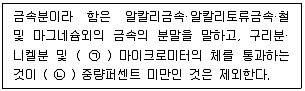
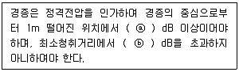
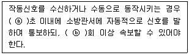
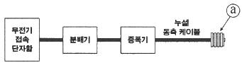

# 소방설비기사(전기분야)20220305(해설집) - 소방전기시설의 구조 및원리

> 원본: `소방설비기사(전기분야)20220305(해설집).pdf`
> 개인학습용 변환본.

## 61. 문제

61. 비상콘센트설비의 성능인증 및 제품검사의 기술기준에 따라 
비상콘센트설비의 절연된 충전부와 외함 간의 절연내력은 
정격전압 150V이하의 경우 60Hz의 정현파에 가까운 실효전
압 1000V 교류전압을 가하는 시험에서 몇 분간 견디어야 
하는가?
    ① 1
② 5
    ③ 10
④ 30
<문제 해설>
비상콘센트설비 절연내력시험

### 정답

1번

### 해설

정답은 1번입니다. 선택지의 핵심개념 을 확인하세요.

### 그림

## 62. 문제

62. 누전경보기의 형식승인 및 제품검사의 기술기준에 따라 비
호환성형 수신부는 신호입력회로에 공칭작동전류치의 42%
에 대응하는 변류기의 설계출력전압을 가하는 경우 몇 초 
이내에 작동하지 아니하여야 하는가?
    ① 10초
② 20초
    ③ 30초
④ 60초
<문제 해설>
수신부의 기능(제26조)
-비호환성 수신부는 신호입력회로에 공칭작동전류치의 42%에 
대응하는 변류기의 설계출력전압을 가하는 경우 30초 이내에 작
동하지 아니하여야 하au, 공칭작동전류치에 대응하는 변류기의 
설계출력전압을 가하는 경우 1초(차단기구가 있는 것은 0.2초)
이내에 작동하여야 한다
-나. 호환성 수신부는 신호입력회로에 공칭작동전류치의 52%에 
대응하는 변류기의 설계출력전압을 가하는 경우 30초 이내에 작
동하지 아니하여야 하며, 공칭작동전류치에 대응하는 변류기의 
4과목 : 소방전기시설의 구조 및 원리

본 해설집은 최강 자격증 기출문제 전자문제집 CBT 해설달기 프로젝트에 의해서 만들어진 자료입니다. 해설을 제공해 주신 모든 분들께 감사 드립니다.
소방설비기사(전기분야)
◐2022년 03월 05일 필기 기출문제 및 해설집◑
전자문제집 CBT : www.comcbt.com
기출문제 해설은 최강 자격증 기출문제 전자문제집 CBT : www.comcbt.com 통해서 실시간으로 변경됩니다.
설계출력전압을 가하는 경우 1초(차단기구가 있는 것은 0.2초)
이내에 작동하여야 한다
[해설작성자 : 해보자]

### 정답

1번

### 해설

정답은 1번입니다. 선택지의 핵심개념 을 확인하세요.

### 그림

## 63. 문제

63. 자동화재탐지설비 및 시각경보장치의 화재안전기준(NFSC 
203)에 따른 감지기의 시설기준으로 옳은 것은?
    ① 스포트형 감지기는 15° 이상 경사되지 아니하도록 부착
할 것
    ② 공기관식 차동식분포형 감지기의 검출부는 45° 이상 경
사되지 아니하도록 부착할 것
    ③ 보상식 스포트형 감지기는 정온점이 감지기 주위의 평상 
시 최고 온도보다 20℃ 이상 높은 것으로 설치할 것
    ④ 정온식 감지기는 주방·보일러실 등으로서 다량의 화기를 
취급하는 장소에 설치하되, 공칭작동온도가 최고주위온
도보다 30℃ 이상 높은 것으로 설치할 것
<문제 해설>

### 정답

1번

### 해설

정답은 1번입니다. 선택지의 핵심개념 을 확인하세요.

## 64. 문제

64. 누전경보기의 화재안전기준(NFSC 205)에 따라 경계전로의 
누설전류를 자동적으로 검출하여 이를 누전경보기의 수신부
에 송신하는 것은?
    ① 변류기
② 변압기
    ③ 음향장치
④ 과전류차단기
<문제 해설>
누전경보기의 화재안전성능기준(NFPC 205)
[시행 2022. 12. 1.] [소방청고시 제2022-49호, 2022. 11. 
25., 전부개정]
제3조(정의)

### 정답

1번

### 해설

정답은 1번입니다. 선택지의 핵심개념 을 확인하세요.

## 65. 문제

65. 비상방송설비의 화재안전기준(NFSC 202)에 따라 전원회로
의 배선으로 사용할 수 없는 것은?
    ① 450/750V 비닐절연전선
    ② 0.6/1kV EP 고무절연 클로로프렌 시스케이블
    ③ 450/750V 저독성 난연 가교 폴리올레핀 절연전선
    ④ 내열성 에틸렌-비닐 아세테이트 고무 절연케이블
<문제 해설>
옥내소화전설비의 화재안전기준(NFSC 102) 별표1 배선에 사용
되는 전선의 종류
- 450/750V 저독성 난연 가교 폴리올레핀 절연 전선
- 0.6/1kV 가교 폴리에틸렌 절연 저독성 난연 폴리올레핀 시스 
전력 케이블
- 6/10kV 가교 폴리에틸렌 절연 저독성 난연 폴리올레핀 시스 
전력용 케이블
- 가교 폴리에틸렌 절연 비닐시스 트레이용 난연 전력 케이블
- 0.6/1kV EP 고무절연 클로로프렌 시스 케이블
- 300/500V 내열성 실리콘 고무 절연전선(180℃)
- 내열성 에틸렌-비닐 아세테이트 고무 절연 케이블
- 버스덕트(Bus Duct)
[해설작성자 : KIIK]

### 정답

1번

### 해설

정답은 1번입니다. 선택지의 핵심개념 을 확인하세요.

## 66. 문제

66. 층수가 5층 이상으로서 연면적 3000m2를 초과하는 특정소
방대상물의 2층에서 발화한 때의 경보 기준으로 옳은 것은? 
(단, 비상방송설비의 화재안전기준(NFSC 202)에 따른다.)
(관련 규정 개정전 문제로 여기서는 기존 정답인 2번을 누
르면 정답 처리됩니다. 자세한 내용은 해설을 참고하세요.)
    ① 발화층에만 경보를 발할 것
    ② 발화층 및 그 직상층에만 경보를 발할 것
    ③ 발화층·그 직상층 및 지하층에 경보를 발할 것
    ④ 발화층·그 직상층 및 기타의 지하층에 경보를 발할 것
<문제 해설>
비상방송설비의 화재안전기준(NFSC 202)

### 정답

1번

### 해설

정답은 1번입니다. 선택지의 핵심개념 을 확인하세요.

## 67. 문제

67. 자동화재탐지설비 및 시각경보장치의 화재안전기준(NFSC 
203)에 따라 감지기회로의 도통시험을 위한 종단저항의 설
치기준으로 틀린 것은?
    ① 감지기회로의 끝부분에 설치할 것
    ② 점검 및 관리가 쉬운 장소에 설치할 것

본 해설집은 최강 자격증 기출문제 전자문제집 CBT 해설달기 프로젝트에 의해서 만들어진 자료입니다. 해설을 제공해 주신 모든 분들께 감사 드립니다.
소방설비기사(전기분야)
◐2022년 03월 05일 필기 기출문제 및 해설집◑
전자문제집 CBT : www.comcbt.com
기출문제 해설은 최강 자격증 기출문제 전자문제집 CBT : www.comcbt.com 통해서 실시간으로 변경됩니다.
    ③ 전용함을 설치하는 경우 그 설치 높이는 바닥으로부터 
2.0m 이내로 할 것
    ④ 종단감지기에 설치할 경우에는 구별이 쉽도록 해당 감지
기의 기판 등에 별도의 표시를 할 것
<문제 해설>
전용함을 설치하는 경우 그 설치 높이는 바닥으로 부터 1.5m 
이내로 할것
[해설작성자 : 부릅뜨니 숲이였어]

### 정답

1번

### 해설

정답은 1번입니다. 선택지의 핵심개념 을 확인하세요.

### 그림

## 68. 문제

68. 경종의 우수품질인증 기술기준에 따른 기능시험에 대한 내
용이다. 다음 ( ) 에 들어갈 내용으로 옳은 것은?
    
    ① ⓐ 90, ⓑ 110
② ⓐ 90, ⓑ 130
    ③ ⓐ 110, ⓑ 90
④ ⓐ 110, ⓑ 130
<문제 해설>
- 경종의 기능시험
)적합기능
1.중심으로부터 1m 떨어진 위치에서 90dB 이상
2.최소청취거리에서 110dB을 초과하지 아니할 것.
+ 알면 좋은 것
) 소비전류: 50mA 이하
[해설작성자 : 모두에게 행운이]

### 정답

1번

### 해설

정답은 1번입니다. 선택지의 핵심개념 을 확인하세요.

### 그림

## 69. 문제

69. 「유통산업발전법」제2조 제3호에 따른 대규모점포(지하상
가 및 지하역사는 제외한다)와 영화상영관에는 보행거리 몇 
m 이내마다 휴대용비상조명등을 3개 이상 설치하여야 하는
가? (단, 비상조명등의 화재안전기준(NFSC 304)에 따른다.)
    ① 50
② 60
    ③ 70
④ 80
<문제 해설>
[휴대용비상조명등 설치기준]

### 정답

1번

### 해설

정답은 1번입니다. 선택지의 핵심개념 을 확인하세요.

### 그림

## 70. 문제

70. 자동화재탐지설비 및 시각경보장치의 화재안전기준(NFSC 
203)에 따라 전화기기실, 통신기기실 등과 같은 훈소화재의 
우려가 있는 장소에 적응성이 없는 감지기는?
    ① 광전식스포트형
    ② 광전아날로그식분리형
    ③ 광전아날로그식스포트형
    ④ 이온아날로그식스포트형
<문제 해설>
훈소화재, 통신기계실에 적응성이 있는 감지기 : 광전식감지기
1) 광전식 스포트형 / 분리형
2) 광전 아날로그식 스포트형 / 분리형
[참고] 광전식 감지기만 적응성 있는 곳 : 연기가 멀리 이동하
는 계단,경사로
[해설작성자 : 향이]

### 정답

1번

### 해설

정답은 1번입니다. 선택지의 핵심개념 을 확인하세요.

### 그림

## 71. 문제

71. 자동화재속보설비의 속보기의 성능인증 및 제품검사의 기술
기준에 따른 속보기의 기능에 대한 내용이다. 다음 ( ) 에 
들어갈 내용으로 옳은 것은?
    
    ① ⓐ 10, ⓑ 3
② ⓐ 10, ⓑ 5
    ③ ⓐ 20, ⓑ 3
④ ⓐ 20, ⓑ 5
<문제 해설>
자동화재속보설비는 감지된 화재신호를 수신기에 수신하여 
5~10초 이내에 오보 또는 화재 여부를 판별
자동화재속보설비에 접속된 사용전화선로를 차단함과 동시에 소
방관서에 소방대상물,발화소재지등을 자동적으로 20초 이내애 3
회 이상 반복하여 신고
- 속보기는 연동 또는 수동 작동에 의한 다이얼링 후 소방관서
에 전화접속이 이루어지지않는 경우 성능
최초 다이얼링을 포함 10회 이상 반복적으로 접속을 위한 다이
얼링
매회 다이얼링 오나료 후 호출 30초 이상 지속
[해설작성자 : comcbt.com 이용자]

### 정답

1번

### 해설

정답은 1번입니다. 선택지의 핵심개념 을 확인하세요.

### 그림

## 72. 문제

72. 비상콘센트설비의 화재안전기준(NFSC 504)에 따른 비상콘
센트설비의 전원회로(비상콘센트에 전력을 공급하는 회로를 
말한다)의 설치기준으로 틀린 것은?
    ① 전원회로는 주배전반에서 전용회로로 할 것
    ② 전원회로는 각층에 1 이상이 되도록 설치할 것
    ③ 콘센트마다 배선용 차단기(KS C 8321)를 설치하여야 하
며, 충전부가 노출되지 아니하도록 할 것
    ④ 비상콘센트설비의 전원회로는 단상교류 220V인 것으로
서, 그 공급용량은 1.5kVA 이상인 것으로 할 것
<문제 해설>
비상콘센트 전원회로는 각층이 2이상 되도록 설치할 것, 다만 
설치할 층의 비상콘센트가 1개인때에는 하나의 회로로 할 수 있
다
[해설작성자 : chemical]

### 정답

1번

### 해설

정답은 1번입니다. 선택지의 핵심개념 을 확인하세요.

### 그림

## 73. 문제

73. 무선통신보조설비의 화재안전기준(NFSC 505)에 따라 분배
기·분파기 및 혼합기 등의 임피던스는 몇 Ω의 것으로 하여
야 하는가?
    ① 10
② 20
    ③ 50
④ 75
<문제 해설>
임피던스는 50옴으로 할 것  

본 해설집은 최강 자격증 기출문제 전자문제집 CBT 해설달기 프로젝트에 의해서 만들어진 자료입니다. 해설을 제공해 주신 모든 분들께 감사 드립니다.
소방설비기사(전기분야)
◐2022년 03월 05일 필기 기출문제 및 해설집◑
전자문제집 CBT : www.comcbt.com
기출문제 해설은 최강 자격증 기출문제 전자문제집 CBT : www.comcbt.com 통해서 실시간으로 변경됩니다.
실기에서 자주 출제 되는 문제이니 무조건 외울것
분분혼5
[해설작성자 : 옥정동 안보 지킴이]

### 정답

1번

### 해설

정답은 1번입니다. 선택지의 핵심개념 을 확인하세요.

### 그림

## 74. 문제

74. 자동화재탐지설비 및 시각경보장치의 화재안전기준(NFSC 
203)에 따라 광전식분리형감지기의 설치기준에 대한 설명으
로 틀린 것은?
    ① 감지기의 수광면은 햇빛을 직접 받지 않도록 설치할 것
    ② 감지기의 송광부와 수광부는 설치된 뒷벽으로부터 1m 
이내 위치에 설치할 것
    ③ 광축(송광면과 수광면의 중심을 연결한 선)은 나란한 벽
으로부터 0.6m 이상 이격하여 설치할 것
    ④ 광축의 높이는 천장 등(천장의 실내에 면한 부분 또는 
상층의 바닥하부면을 말한다) 높이의 70% 이상일 것
<문제 해설>
광축의높이는 천장 등(천장의 실내에 면한 부분 또는 상층의 바
닥하부면을 말한다) 높이의 80% 이상일것
[해설작성자 : 부릅뜨니 숲이였어]

### 정답

1번

### 해설

정답은 1번입니다. 선택지의 핵심개념 을 확인하세요.

### 그림

## 75. 문제

75. 유도등의 형식승인 및 제품검사의 기술기준에 따라 유도등
의 교류입력측과 외함 사이, 교류입력측과 충전부 사이 및 
절연된 충전부와 외함 사이의 각 절연저항을 DC 500V의 절
연저항계로 측정한 값이 몇 MΩ 이상이어야 하는가?
    ① 0.1
② 5
    ③ 20
④ 50
<문제 해설>
제18조(절연저항시험) 교류입력측과 외함사이,절연된 충전부와 
외함 사이의 측정값은 5MΩ 이상이어야 한다
[해설작성자 : 신영]

### 정답

1번

### 해설

정답은 1번입니다. 선택지의 핵심개념 을 확인하세요.

### 그림

## 76. 문제

76. 비상경보설비의 축전지의 성능인증 및 제품검사의 기술기준
에 따른 축전지설비의 외함 두께는 강판인 경우 몇 mm 이
상이어야 하는가?
    ① 0.7
② 1.2
    ③ 2.3
④ 3
<문제 해설>
비상경보설비의 축전지의 성능인증 및 제품검사의 기술기준
[시행 2022. 12. 1.] [소방청고시 제2022-28호, 2022. 12. 1., 
타법개정]
제4조(외함) 축전지설비의 외함은 다음에 적합하여야 한다.

### 정답

1번

### 해설

정답은 1번입니다. 선택지의 핵심개념 을 확인하세요.

### 그림

## 77. 문제

77. 유도등 및 유도표지의 화재안전기준(NFSC 303)에 따라 객
석 내 통로의 직선부분 길이가 85m인 경우 객석유도등을 
몇 개 설치하여야 하는가?
    ① 17개
② 19개
    ③ 21개
④ 22개
<문제 해설>
유도등 및 유도표지의 화재안전기준(NFSC303)
제7조(객석유도등 설치기준)
① 객석유도등은 객석의 통로, 바닥 또는 벽에 설치하여야 한
다..
② 객석내의 통로가 경사로 또는 수평로로 되어 있는 부분은 다
음의 식에 따라 산출한 수(소수점 이하의 수는 1로 본다)의 유
도등을 설치하여야 한다.
설치개수= (객석의 통로의 직선부분의 길이(m)/4) - 1
[해설작성자 : 붕차카붕]

### 정답

1번

### 해설

정답은 1번입니다. 선택지의 핵심개념 을 확인하세요.

### 그림

## 78. 문제

78. 비상경보설비 및 단독경보형감지기의 화재안전기준(NFSC 
201)에 따른 용어에 대한 정의로 틀린 것은?
    ① 비상벨설비라 함은 화재발생 상황을 경종으로 경보하는 
설비를 말한다.
    ② 자동식사이렌설비라 함은 화재발생 상황을 사이렌으로 
경보하는 설비를 말한다.
    ③ 수신기라 함은 발신기에서 발하는 화재신호를 간접 수신
하여 화재의 발생을 표시 및 경보하여 주는 장치를 말한
다.
    ④ 단독경보형감지기라 함은 화재발생 상황을 단독으로 감
지하여 자체에 내장된 음향장치로 경보하는 감지기를 말
한다.
<문제 해설>

### 정답

1번

### 해설

정답은 1번입니다. 선택지의 핵심개념 을 확인하세요.

### 그림

## 79. 문제

79. 다음의 무선통신보조설비 그림에서 ⓐ에 해당하는 것은?
    
    ① 혼합기
    ② 옥외안테나
    ③ 무선중계기
    ④ 무반사종단저항
<문제 해설>
무선통신보조설비 끝부분에 무반사 종단저항 설치
[해설작성자 : comcbt.com 이용자]

### 정답

1번

### 해설

정답은 1번입니다. 선택지의 핵심개념 을 확인하세요.

### 그림

## 80. 문제

80. 축전지의 자기방전을 보충함과 동시에 상용부하에 대한 전
력공급은 충전기가 부담하도록 하되 충전기가 부담하기 어
려운 일시적인 대전류 부하는 축전지로 하여금 부담하게 하
는 충전방식은?
    ① 보통충전방식
② 균등충전방식
    ③ 부동충전방식
④ 급속충전방식
<문제 해설>
부동충전의 부동은 움직이지 않는다의 "부동"이 아니라 "떠다닌
다"(Floating Charge)의 의미로 "부동"임
충전기가 축전지에 항상 정전압을 유지할 정도로 충전하면서 축
전지의 자기방전을 보충하고 있다가
일시에 대전류가 요구되면 축전지의 전류를 퍼서 가져가는 원리

본 해설집은 최강 자격증 기출문제 전자문제집 CBT 해설달기 프로젝트에 의해서 만들어진 자료입니다. 해설을 제공해 주신 모든 분들께 감사 드립니다.
소방설비기사(전기분야)
◐2022년 03월 05일 필기 기출문제 및 해설집◑
전자문제집 CBT : www.comcbt.com
기출문제 해설은 최강 자격증 기출문제 전자문제집 CBT : www.comcbt.com 통해서 실시간으로 변경됩니다.
임
물이 항상 가득 차 있는 물통에서 자연증발하는 정도를 충전시
키다가 필요할 때 바가지로 물을 퍼가는 모습을 상상하면 이해
하기 쉬움
[해설작성자 : comcbt.com 이용자]
본 해설집의 저작권은 www.comcbt.com에 있으며
카페, 블로그 등의 업로드 및 개인적 활용 이외에
문서의 수정 및 DB 저장, 기타 금전적 이익을 취하는
일체의 행위를 금지 합니다.
전자문제집 CBT 홈페이지 : www.comcbt.com
기출문제 및 해설집 다운로드 : www.comcbt.com/xe
전자문제집 CBT 앱(구글플레이) : [다운로드]
전자문제집 CBT란?
인터넷으로 종이 없이 문제를 풀고 자동채점하는 프로그램으로 
워드, 컴활, 기능사 등의 상설검정에서 사용하는 실제 프로그램 
방식입니다.
해설을 제공하며 PC 버전 및 모바일 버전 완벽 연동
교사용/학생용 관리기능도 제공합니다.
오답 및 오탈자가 수정된 최신 자료와 해설은 전자문제집 CBT 
에서 확인하세요.
1
2
3
4
5
6
7
8
9
10
①
④
④
④
④
②
③
②
④
①
11
12
13
14
15
16
17
18
19
20
④
①
③
①
④
③
②
③
②
②
21
22
23
24
25
26
27
28
29
30
②
②
①
①
④
①
②
①
②
②
31
32
33
34
35
36
37
38
39
40
③
④
②
④
④
②
③
②
②
②
41
42
43
44
45
46
47
48
49
50
③
③
②
④
①
④
③
③
③
②
51
52
53
54
55
56
57
58
59
60
②
①
④
④
③
①
①
①
②
①
61
62
63
64
65
66
67
68
69
70
①
③
③
①
①
②
③
①
①
④
71
72
73
74
75
76
77
78
79
80
③
②
③
④
②
②
③
③
④
③

### 정답

1번

### 해설

정답은 1번입니다. 선택지의 핵심개념 을 확인하세요.

### 그림

