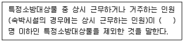
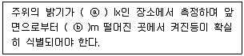
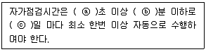
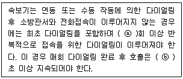

# 소방설비기사(전기분야)20220424(해설집) - 소방전기시설의 구조 및원리

> 원본: `소방설비기사(전기분야)20220424(해설집).pdf`
> 개인학습용 변환본.

## 61. 문제

61. 소방시설용 비상전원수전설비의 화재안전기준(NFSC 602)에 
따라 저압으로 수전하는 제1종 배전반 및 분전반의 외함 두
께와 전면판(또는 문) 두께에 대한 설치기준으로 옳은 것은?
    ① 외함 : 1.0mm 이상, 전면판(또는 문) : 1.2mm 이상
    ② 외함 : 1.2mm 이상, 전면판(또는 문) : 1.5mm 이상
    ③ 외함 : 1.5mm 이상, 전면판(또는 문) : 2.0mm 이상
    ④ 외함 : 1.6mm 이상, 전면판(또는 문) : 2.3mm 이상
<문제 해설>
<NFSC 602>
제6조(저압으로 수전하는 경우)
1.제1종 배전반 및 제1종 분전반은 다음 각 호에 적합하게 설치
하여야 한다.
(1)외함은 두께 1.6mm(전면판 및 문은 2.3mm) 이상의 강판과 
이와 동등 이상의 강도와 내화성능이 있는 것으로 제작할 것
[해설작성자 : 소방전기공부중]

### 정답

1번

### 해설

정답은 1번입니다. 선택지의 핵심개념 을 확인하세요.

### 그림

## 62. 문제

62. 무선통신보조설비의 화재안전기준(NFSC 505)에서 정하는 
분배기·분파기 및 혼합기 등의 임피던스는 몇 Ω의 것으로 
하여야 하는가?
    ① 10
② 30
    ③ 50
④ 100
<문제 해설>
<NFSC 505>
제7조(분배기 등)

### 정답

1번

### 해설

정답은 1번입니다. 선택지의 핵심개념 을 확인하세요.

### 그림

## 63. 문제

63. 비상콘센트설비의 성능인증 및 제품검사의 기술기준에 따라 
절연저항 시험부위의 절연내력은 정격전압 150V 이하의 경
우 60Hz의 정현파에 가까운 실효전압 1000V 교류전압을 가
하는 시험에서 몇 분간 견디는 것이어야 하는가?
    ① 1
② 10
    ③ 30
④ 60
<문제 해설>
<NFSC 504>
제4조(비상콘센트설비 절연내력시험)
150V이하:실효전압 1000V 1분이상
150V이상:실효전압 (정격전압×2)+1000V 1분이상
4과목 : 소방전기시설의 구조 및 원리

본 해설집은 최강 자격증 기출문제 전자문제집 CBT 해설달기 프로젝트에 의해서 만들어진 자료입니다. 해설을 제공해 주신 모든 분들께 감사 드립니다.
소방설비기사(전기분야)
◐2022년 04월 24일 필기 기출문제 및 해설집◑
전자문제집 CBT : www.comcbt.com
기출문제 해설은 최강 자격증 기출문제 전자문제집 CBT : www.comcbt.com 통해서 실시간으로 변경됩니다.
[해설작성자 : 소방전기공부중]

### 정답

1번

### 해설

정답은 1번입니다. 선택지의 핵심개념 을 확인하세요.

### 그림

## 64. 문제

64. 다음은 누전경보기의 형식승인 및 제품검사의 기술기준에 
따른 표시등에 대한 내용이다. ( )에 들어갈 내용으로 옳은 
것은?
    
    ① ⓐ 150, ⓑ 3
② ⓐ 300, ⓑ 3
    ③ ⓐ 150, ⓑ 5
④ ⓐ 300, ⓑ 5
<문제 해설>
<누전경보기의 형식승인 및 제품검사의 기술기준>
제4조(부품의 구조 및 기능)
2.표시등
바.주위의 밝기가 300 lx인 장소에서 측정하여 앞면으로부터 3m 
떨어진 곳에서 켜진등이 확실히 식별되어야 한다.
[해설작성자 : 소방전기공부중]

### 정답

1번

### 해설

정답은 1번입니다. 선택지의 핵심개념 을 확인하세요.

### 그림

## 65. 문제

65. 무선통신보조설비의 화재안전기준(NFSC 505)에 따라 무선
통신보조설비의 누설동축케이블 및 동축케이블은 화재에 따
라 해당 케이블의 피복이 소실된 경우에 케이블 본체가 떨
어지지 아니하도록 몇 m 이내마다 금속제 또는 자기제등의 
지지금구로 벽·천장·기둥 등에 견고하게 고정시켜야 하는가? 
(단, 불연재료로 구획된 반자 안에 설치하지 않은 경우이
다.)
    ① 1
② 1.5
    ③ 2.5
④ 4
<문제 해설>
<NFSC 505>
제5조(누설동축케이블 등)
4.누설동축케이블은 화재에 따라 해당 케이블의 피복이 소실된 
경우에 케이블 본체가 떨어지지 아니하도록 4m 이내마다 금속
제 또는 자기제 등의 지지금구로 벽•천장•기둥 등에 견고하게 고
정시킬 것.
다만 불연재료로 구획된 반자 안에 설치하는 경우에는 그러하지 
아니하다.
[해설작성자 : 소방전기공부중]

### 정답

1번

### 해설

정답은 1번입니다. 선택지의 핵심개념 을 확인하세요.

### 그림

## 66. 문제

66. 비상콘센트설비의 화재안전기준(NFSC 504)에 따라 비상콘
센트용의 풀박스 등은 방청도장을 한 것으로서, 두께 몇 
mm 이상의 철판으로 하여야 하는가?
    ① 1.0
② 1.2
    ③ 1.5
④ 1.6
<문제 해설>
<NFSC 504>
제4조(전원 및 콘센트 등)
2.비상콘센트설비의 전원회로
(7)비상콘센트용의 풀박스 등은 방청도장을 한 것으로서, 두께 
1.6mm 이상의 철판으로 할 것
[해설작성자 : 소방전기공부중]

### 정답

1번

### 해설

정답은 1번입니다. 선택지의 핵심개념 을 확인하세요.

### 그림

## 67. 문제

67. 자동화재탐지설비 및 시각경보장치의 화재안전기준(NFSC 
203)에서 정하는 불꽃감지기의 시설기준으로 틀린 것은?
    ① 폭발의 우려가 있는 장소에는 방폭형으로 설치할 것
    ② 공칭감시거리 및 공칭시야각은 형식승인 내용에 따를 것
    ③ 감지기를 천장에 설치하는 경우에는 감지기는 바닥을 향
하여 설치할 것
    ④ 감지기는 화재감지를 유효하게 감지할 수 있는 모서리 
또는 벽 등에 설치할 것
<문제 해설>
<NFSC 203>
제7조(감지기)
3.감지기는 다음 각 호의 기준에 따라 설치하여야 한다.
(13)불꽃감지기는 다음의 기준에 따라 설치할 것
가.공칭감시거리 및 공칭시야각은 형식승인 내용에 따를것
나.감지기는 공칭감시거리와 공칭시야각을 기준으로 감시구역이 
모두 포용될 수 있도록 설치할 것
다.감지기는 화재감지를 유효하게 감지할 수 있는 모서리 또는 
벽 등에 설치할 것
라.감지기를 천장에 설치하는 경우에는 감지기는 바닥을 향하여 
설치할 것
마.수분이 많이 발생할 우려가 있는 장소에는 방수형으로 설치
할 것
바.그밖의 설치기준은 형식승인 내용에 따르며 형식승인 사항이 
아닌 것은 제조사의 시방에 따라 설치할 것
[해설작성자 : 소방전기공부중]

### 정답

1번

### 해설

정답은 1번입니다. 선택지의 핵심개념 을 확인하세요.

### 그림

## 68. 문제

68. 다음은 비상조명등의 우수품질인증 기술기준에서 정하는 비
상조명등의 상태를 자동적으로 점검하는 기능에 대한 내용
이다. ( )에 들어갈 내용으로 옳은 것은?
    
    ① ⓐ 15, ⓑ 15, ⓒ 15
    ② ⓐ 15, ⓑ 20, ⓒ 30
    ③ ⓐ 30, ⓑ 30, ⓒ 30
    ④ ⓐ 30, ⓑ 45, ⓒ 60
<문제 해설>
<비상조명등의 우수품질인증 기술기준>
제15조(자가점검 및 무선점검시험)

### 정답

1번

### 해설

정답은 1번입니다. 선택지의 핵심개념 을 확인하세요.

### 그림

## 69. 문제

69. 자동화재탐지설비 및 시각경보장치의 화재안전기준(NFSC 

본 해설집은 최강 자격증 기출문제 전자문제집 CBT 해설달기 프로젝트에 의해서 만들어진 자료입니다. 해설을 제공해 주신 모든 분들께 감사 드립니다.
소방설비기사(전기분야)
◐2022년 04월 24일 필기 기출문제 및 해설집◑
전자문제집 CBT : www.comcbt.com
기출문제 해설은 최강 자격증 기출문제 전자문제집 CBT : www.comcbt.com 통해서 실시간으로 변경됩니다.
203)에 따라 부착 높이가 4m 미만으로 연기감지기 3종을 
설치할 때, 바닥면적 몇 m2 마다 1개 이상 설치하여야 하는
가?
    ① 50
② 75
    ③ 100
④ 150
<문제 해설>
<연기감지기>     1종,2종    3종
   4m 미만        150      50
4m이상 20m미만      75
[해설작성자 : 소방전기공부중]

### 정답

1번

### 해설

정답은 1번입니다. 선택지의 핵심개념 을 확인하세요.

### 그림

## 70. 문제

70. 비상방송설비와 자동화재탐지설비의 연동 시 동작 순서로 
옳은 것은?
    ① 기동장치 → 증폭기 → 수신기 → 조작부 → 확성기
    ② 기동장치 → 조작부 → 증폭기 → 수신기 → 확성기
    ③ 기동장치 → 수신기 → 증폭기 → 조작부 → 확성기
    ④ 기동장치 → 증폭기 → 조작부 → 수신기 → 확성기
<문제 해설>
기동장치(감지기)- 수신기- 증폭기- 조작부(조작장치) -확성기
(스피커)
[해설작성자 : 수험생]
기동장치(감지기에서 화재감지)  -> 수신기(화재신호 받음) ->
(요기부터 방송장비) 증폭기(엠프) -> 조작부(자동) -> 확성기
(스피커)
이렇게 이해하면 쉬움...불나면 감지기 작동하고 수신기에서 방
송장비로 신호전달후 증폭기 켜지고 비상방송 송출 명령이 떨어
지면 확성기(스피커)를 통하여 방송송출

### 정답

1번

### 해설

정답은 1번입니다. 선택지의 핵심개념 을 확인하세요.

## 71. 문제

71. 유도등의 우수품질인증 기술기준에서 정하는 유도등의 일반
구조에 적합하지 않은 것은?
    ① 축전지에 배선 등은 직접 납땜하여야 한다.
    ② 충전부가 노출되지 아니한 것은 사용전압이 300V를 초
과할 수 있다.
    ③ 외함은 기기 내의 온도 상승에 의하여 변형, 변색 또는 
변질되지 아니하여야 한다.
    ④ 전선의 굵기는 인출선인 경우에는 단면적이 0.75mm2 이
상, 인출선 외의 경우에는 면적이 0.5mm2 이상이어야 
한다.
<문제 해설>
<유도등의 우수품질인증 기술기준>
제2조(일반구조)

### 정답

1번

### 해설

정답은 1번입니다. 선택지의 핵심개념 을 확인하세요.

## 72. 문제

72. 축광표지의 성능인증 및 제품검사의 기술기준에 따라 피난
방향 또는 소방용품 등의 위치를 추가적으로 알려주는 보조
역할을 하는 축광보조표지의 설치 위치로 틀린 것은?
    ① 바닥
② 천장
    ③ 계단
④ 벽면
<문제 해설>
<축광표지의 성능인증 및 제품검사의 기술기준>
제2조(용어의 정의)
6.축광보조표지란 피난로 등의 바닥•계단•벽면 등에 설치함으로
서 피난방향 또는 소방용품 등의 위치를 추가적으로 알려주는 
보조역할을 하는 표지를 말한다.
[해설작성자 : 소방전기공부중]
피난갈때 연기 피해서 고개 숙이고 이동하는데 천장 볼 시간이 
없습니다..
[해설작성자 : 내일 시험...]
불나면 뿌연 연기가 어디로 갈까요? 천장으로 갑니다..그럼 천장
에 설치하면 안보이겟죠
[해설작성자 : 야매로]

### 정답

1번

### 해설

정답은 1번입니다. 선택지의 핵심개념 을 확인하세요.

## 73. 문제

73. 시각경보장치의 성능인증 및 제품검사의 기술기준에 따라 
시각 경보장치의 전원부 양단자 또는 양선을 단락시킨 부분
과 비충전부를 DC 500V의 절연저항계로 측정하는 경우 절
연저항이 몇 ㏁ 이상이어야 하는가?
    ① 0.1
② 5
    ③ 10
④ 20
<문제 해설>
<시각경보장치의 성능인증 및 제품검사의 기술기준>
제10조(절연저항시험)
-시각경보장치의 전원부 양단자 또는 양선을 단락시킨 부분과 
비충전부를 DC 500V의 절연저항계로 측정하는 경우 절연저항이 
5M옴 이상이어야 한다.
[해설작성자 : 소방전기공부중]

### 정답

1번

### 해설

정답은 1번입니다. 선택지의 핵심개념 을 확인하세요.

## 74. 문제

74. 누전경보기의 형식승인 및 제품검사의 기술기준에서 정하는 
누전경보기의 공칭작동전류치(누전경보기를 작동시키기 위
하여 필요한 누설전류의 값으로서 제조자에 의하여 표시된 
값을 말한다.)는 몇 ㎃ 이하이어야 하는가?
    ① 50
② 100
    ③ 150
④ 200
<문제 해설>
<누전경보기의 형식승인 및 제품검사의 기술기준>
제7조(공칭작동전류치)
(1)누전경보기의 공칭작동전류치(누전경보기를 작동시키기 위하
여 필요한 누설전류의 값으로서 제조자에 의하여 표시된 값을 
말한다.이하 같다)는 200mA 이하이어야 한다.
(2)제1항의 규정은 감도조정장치를 가지고 있는 누전경보기에 
있어서도 그 조정범위의 최소치에 대하여 이를 적용한다.
[해설작성자 : 소방전기공부중]

### 정답

1번

### 해설

정답은 1번입니다. 선택지의 핵심개념 을 확인하세요.

## 75. 문제

75. 다음은 자동화재속보설비의 속보기의 성능인증 및 제품검사
의 기술기준에 따른 속보기에 대한 내용이다. ( )에 들어갈 

본 해설집은 최강 자격증 기출문제 전자문제집 CBT 해설달기 프로젝트에 의해서 만들어진 자료입니다. 해설을 제공해 주신 모든 분들께 감사 드립니다.
소방설비기사(전기분야)
◐2022년 04월 24일 필기 기출문제 및 해설집◑
전자문제집 CBT : www.comcbt.com
기출문제 해설은 최강 자격증 기출문제 전자문제집 CBT : www.comcbt.com 통해서 실시간으로 변경됩니다.
내용으로 옳은 것은?
    
    ① ⓐ 10, ⓑ 30
② ⓐ 15, ⓑ 30
    ③ ⓐ 10, ⓑ 60
④ ⓐ 15, ⓑ 60
<문제 해설>
<속보기의 성능인증 및 제품검사의 기술기준>
제5조(기능)
8.속보기는 연동 또는 수동 작동에 의한 다이얼링 후 소방관서
와 전화접속이 이루어지지 않는 경우에는 최초 다이얼링을 포함
하여 10회 이상 반복적으로 접속을 위한 다이얼링이 이루어져야 
한다..이 경우 매회 다이얼링 완료 후 호출은 30초 이상 지속되
어야 한다.
[해설작성자 : 소방전기공부중]

### 정답

1번

### 해설

정답은 1번입니다. 선택지의 핵심개념 을 확인하세요.

### 그림

## 76. 문제

76. 단독경보형감지기에 대한 설명으로 틀린 것은?
    ① 단독경보형감지기는 감지부, 경보장치, 전원이 개별로 구
성되어 있다.
    ② 화재경보음은 감지기로부터 1m 떨어진 위치에서 85dB 
이상으로 10분 이상 계속하여 경보할 수 있어야 한다.
    ③ 단독경보형감지기는 수동으로 작동시험을 하고 자동복귀
형 스위치에 의하여 자동으로 정위치에 복귀하여야 한
다.
    ④ 작동되는 감지기는 작동표시등에 의하여 화재의 발생을 
표시하고, 내장된 음향장치의 명동에 의하여 화재경보음
을 발하여야 한다.
<문제 해설>
단독경보형감지기란 화재발생 상황을 단독으로 감지하여 자체에 
내장된 음향장치로 경보하는 감지기를 말한다
<출처> 비상경보설비 및 단독경보형감지기의 화재안전기준[개정
2021.1.15]
[해설작성자 : comcbt.com 이용자]
개별로 구성이 아닌 세트로 구성(자체 내장)
[해설작성자 : comcbt.com 이용자]
아래와 같은 오류 신고가 있었습니다.
여러분들의 많은 의견 부탁 드립니다.
추후 여러분들의 의견을 반영하여 정답을 수정하도록 하겠습니
다.
참고로 정답 변경은 오류 신고 5회 이상일 경우 수정합니다.
[오류 신고 내용]
90dB로 바뀌어서 2번도 정답 ㅠ
[해설작성자 : comcbt.com 이용자]
[오류신고 반론]
90dB이라 하신분은 비상경보설비쪽 보고 착각하신거 같네요.
감지기의 형식승인 및 제품검사의 기술기준(23.12.07)
제5조의2(단독경보형감지기의 일반기능)

### 정답

1번

### 해설

정답은 1번입니다. 선택지의 핵심개념 을 확인하세요.

### 그림

## 77. 문제

77. 비상방송설비의 음향장치는 정격전압의 몇 % 전압에서 음
향을 발할 수 있는 것으로 하여야 하는가?
    ① 80
② 90
    ③ 100
④ 110
<문제 해설>
<NFSC 202>
제4조(음향장치)
12.음향장치는 다음 각 목의 기준에 따른 구조 및 성능의 것으
로 하여야 한다.
가. 정격전압의 80% 전압에서 음향을 발할 수 있는 것으로 할 
것
나. 자동화재탐지설비의 작동과 연동하여 작동할 수 있는 것으
로 할 것
[해설작성자 : 소방전기공부중]

### 정답

1번

### 해설

정답은 1번입니다. 선택지의 핵심개념 을 확인하세요.

### 그림

## 78. 문제

78. 소방시설용 비상전원수전설비의 화재안전기준(NFSC 602)에 
따라 소방회로배선은 일반회로배선과 불연성 벽으로 구획하
여야 하나, 소방회로배선과 일반회로배선을 몇 ㎝ 이상 떨
어져 설치한 경우에는 그러하지 아니하는가?
    ① 5
② 10
    ③ 15
④ 20
<문제 해설>

본 해설집은 최강 자격증 기출문제 전자문제집 CBT 해설달기 프로젝트에 의해서 만들어진 자료입니다. 해설을 제공해 주신 모든 분들께 감사 드립니다.
소방설비기사(전기분야)
◐2022년 04월 24일 필기 기출문제 및 해설집◑
전자문제집 CBT : www.comcbt.com
기출문제 해설은 최강 자격증 기출문제 전자문제집 CBT : www.comcbt.com 통해서 실시간으로 변경됩니다.
<NFSC 602>
제5조(특별고압 또는 고압으로 수전하는 경우)
(1)일반전기사업자로부터 특별고압 또는 고압으로 수전하는 비
상전원 수전설비는 방화구획형,옥외개방형 또는 큐비클형으로 
하여야 한다.
2.소방회로배선은 일반회로배선과 불연성 벽으로 구획할 것. 다
만, 소방회로배선과 일반회로배선을 15cm 이상 떨어져 설치한 
경우는 그러하지 아니한다.
[해설작성자 : 소방전기공부중]

### 정답

1번

### 해설

정답은 1번입니다. 선택지의 핵심개념 을 확인하세요.

### 그림

## 79. 문제

79. 경종의 우수품질인증 기술기준에 따라 경종에 정격전압을 
인가한 경우 경종의 소비전류는 몇 mA 이하이어야 하는가?
    ① 10
② 30
    ③ 50
④ 100
<문제 해설>
<경종의 우수품질인증 기술기준>
제4조(기능시험)
경종은 정격전압을 인가하여 다음 각 호의 기능에 적합하여야 
한다.
1.경종의 중심으로부터 1m 떨어진 위치에서 90dB 이상이어야 
하며, 최소청취거리에서 110dB을 초과하지 아니하여야 한다.
2.경종의 소비전류는 50mA 이하이어야 한다.
[해설작성자 : 소방전기공부중]

### 정답

1번

### 해설

정답은 1번입니다. 선택지의 핵심개념 을 확인하세요.

## 80. 문제

80. 자동화재탐지설비 및 시각경보장치의 화재안전기준(NFSC 
203)에 따라 감지기 상호 간 또는 감지기로부터 수신기에 
이르는 감지기회로의 배선 중 전자파 방해를 받지 아니하는 
쉴드선 등을 사용하지 않아도 되는 것은?
    ① R형 수신기용으로 사용되는 것
    ② 차동식 감지기
    ③ 다신호식 감지기
    ④ 아날로그식 감지기
<문제 해설>
<NFSC 203>
제11조(배선)
2.감지기 상호간 또는 감지기로부터 수신기에 이르는 감지기회
로의 배선은 다음 각 목의 기준에 따라 설치할 것
가.아날로그식,다신호식 감지기나 R형 수신기용으로 사용되는 
것은 전자파 방해를 받지 아니하는 쉴드선 등을 사용하여야 하
며, 광케이블의 경우에는 전자파 방해를 받지 아니하고 내열성
능이 있는 경우 사용할 수 있다..다만, 전자파 방해를 받지 아니
하는 방식의 경우에는 그러하지 아니하다.
[해설작성자 : 소방전기공부중]
본 해설집의 저작권은 www.comcbt.com에 있으며
카페, 블로그 등의 업로드 및 개인적 활용 이외에
문서의 수정 및 DB 저장, 기타 금전적 이익을 취하는
일체의 행위를 금지 합니다.
전자문제집 CBT 홈페이지 : www.comcbt.com
기출문제 및 해설집 다운로드 : www.comcbt.com/xe
전자문제집 CBT 앱(구글플레이) : [다운로드]
전자문제집 CBT란?
인터넷으로 종이 없이 문제를 풀고 자동채점하는 프로그램으로 
워드, 컴활, 기능사 등의 상설검정에서 사용하는 실제 프로그램 
방식입니다.
해설을 제공하며 PC 버전 및 모바일 버전 완벽 연동
교사용/학생용 관리기능도 제공합니다.
오답 및 오탈자가 수정된 최신 자료와 해설은 전자문제집 CBT 
에서 확인하세요.
1
2
3
4
5
6
7
8
9
10
②
①
②
①
②
②
③
②
④
④
11
12
13
14
15
16
17
18
19
20
③
④
①
①
①
③
④
③
②
①
21
22
23
24
25
26
27
28
29
30
①
④
③
①
①
②
②
③
③
③
31
32
33
34
35
36
37
38
39
40
①
③
②
③
④
④
②
②
①
①
41
42
43
44
45
46
47
48
49
50
①
③
②
③
①
③
③
①
②
④
51
52
53
54
55
56
57
58
59
60
④
②
③
③
①
③
④
①
②
④
61
62
63
64
65
66
67
68
69
70
④
③
①
②
④
④
①
③
①
③
71
72
73
74
75
76
77
78
79
80
①
②
②
④
①
①
①
③
③
②

### 정답

1번

### 해설

정답은 1번입니다. 선택지의 핵심개념 을 확인하세요.
